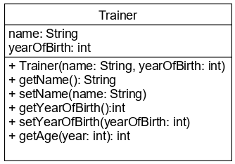
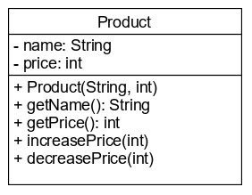
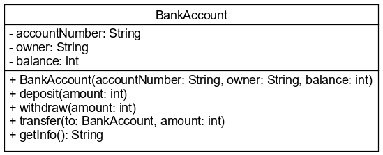

# UML, példányok konzol íráskor/olvasáskor

Az osztály egységbe zárja az összetartozó adatokat és a rajtuk végzett
műveleteket. Háromféle tagját különböztetjük meg:

* **attribútum**: az adatok tárolására szolgáló változók
* **konstruktor**: az adatok inicializálására szolgáló speciális metódus,
mely példányosításkor fut le
* **metódus**: az állapot lekérdezésére, módosítására szolgáló műveletek

## UML (Unified Modeling Language)

Szabványos, általános célú modellező nyelv, amely alkalmas nagy méretű
rendszerek vizuális megjelenítésére, dokumentálására. A diagramok
alkalmasak a rendszer struktúrájának és viselkedésének leírására. Egyik
leggyakrabban használt diagramja a osztálydiagram, mely az osztályok és
kapcsolataik grafikus ábrázolására szolgál. Az osztályokat egy három
részre osztott téglalap jelöli. A felső részben található az osztály
neve, a középsőben az attribútumok, a harmadikban a metódusok sora.
A tagok láthatóságát speciális karakterek jelölik a tag neve előtt.

Metódusok esetén gyakran találkozunk azzal, hogy a paramétereknek csak típusa 
van, neve nincs. Ilyenkor tetszőleges, de beszédes nevet adhatunk nekik. Az UML 
osztálydiagram csak akkor tartalmazza a neveket is, ha több paraméter esetén nem 
egyértelmű azok szerepe. Például két `String` típusú paraméter is van.  



## Konzol használata objektum létrehozásakor

Az objektum létrehozásához szükséges adatokat a felhasználótól `Scanner`
objektum segítségével kérhetjük be, majd a létrehozott objektum aktuális
állapotát `System.out.println()` metódussal írhatjuk ki. Lássunk is egy
teljes példát erre:

```java
package trainer;

public class TrainerMain {

    public static void main(String[] args) {
        System.out.println("What is your name?");
        Scanner scanner = new Scanner(System.in);
        String name = scanner.nextLine();
    
        System.out.println("Year of birth?");
        int yearOfBirth = scanner.nextInt();
    
        Trainer trainer = new Trainer(name, yearOfBirth);
    
        System.out.println(trainer.getName());
        System.out.println(trainer.getNameAndYearOfBirth());
        System.out.println("Age: " + trainer.getAge(2019));
    }
}
```
## Ellenőrző kérdések

* Mi az UML?
* Hogyan épül fel egy osztálydiagram?
* Milyen részekből áll egy osztály diagramelem?

## Feladat

### Termék osztály

Az alábbi diagram és a leírás alapján készítsd el a `Product` osztályt!



Az attribútumok kezdőértéket a konstruktorban kapnak. Az `increasePrice()` a paraméter 
értékével növeli, a `decreasePrice()` pedig csökkenti az aktuális árat.

Próbáld ki az osztály működését `main()` metódusban, ahol a példány létrehozásához 
szükséges adatokat a felhasználótól kéred be!

### Bankszámlák

Az UML diagram és a leírás alapján készítsd el a `BankAccount` osztályt!



Számlanyitáshoz mindhárom attribútum értékét meg kell adni. A számlára lehet 
befizetni (`deposit()`), lehet róla pénzt kivenni (`withdraw()`), illetve másik 
számlára át lehet utalni összeget (`transfer()`). Ez utóbbi esetben a számla saját 
egyenlege csökken, de a másik számla egyenlegére jóváírás történik.

A `getInfo()` metódus a számla adatait az alábbi formában adja vissza Stringként:

```
10073217-12000098-67341590   
Tóth Kálmán   
103400 Ft
```

Sortörést a szövegbe a `\n` karakterekkel tudsz elhelyezni.

Készíts egy `Bank` osztályt, amely `main()` metódusában létrehozol két bankszámlát! 
Próbáld ki az összes elkészített metódust, hogy jól működik-e! Átutalásnál ellenőrizd
mindkét számla új egyenlegét!

## Forrás

OCA - Chapter 1/Understanding the Java Class Structure, Writing a main() Method

## Teszt

Az UML osztálydiagramon az osztály diagramelem milyen három részre oszlik?

* Osztály neve, láthatóságok, tagok
* Osztály típusa, osztály neve, tagok
* Privát tagok, publikus tagok, osztály neve
* [x] Osztály neve, attribútumok, metódusok
