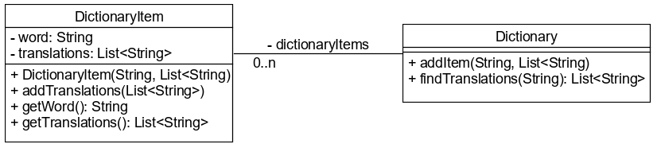

# Ciklusok

## A `while` utasítás

A `while` utasítás két részből áll: fejléc és törzs. A fejlécben egy logikai 
kifejezést kell definiálni. Addig hajtja végre a törzset, amíg a fejlécben lévő kifejezés igaz. 
Minden végrehajtás előtt kiértékelődik a feltétel, és amint hamis lesz, kiugrik az utasításból.

Vigyázzunk, nagyon könnyű végtelen ciklust implementálni. Például ha a lenti példában 
elfelejtjük növelni a ciklusváltozót.

```java
int count = 1;
while(count < 11){
    System.out.println("Count is: " + count);
    count++;
}
```

## `do-while` utasítás

A feltétel a ciklus végén értékelődik ki, így a törzs egyszer mindenképpen lefut.

```java
int count = 1;
do {
  System.out.println("Count is: " + count);
  count++;  
} while(count < 11);

```

A fenti példában amennyiben a `count` értékét 20-ra állítjuk kezdetben, akkor `while` 
esetén nem írna ki semmit, `do-while` esetén viszont kiírja egyszer, hogy 20.

## `for` utasítás

Szintén fejből és törzsből áll. A fej a következőket tartalmazza:

* Inicializációs utasítás
* Feltétel
* Léptető utasítás

Az inicializációs utasításban deklarált változó(k) csak a ciklus törzsében látható(ak). 
A `for` ciklus gyakran használjuk 0 és n-1 közötti értékek bejárására.

```java
for (int i = 0; i < 10; i++) {
    System.out.println(i);
}
```

A fejben található három részből bármelyik elhagyható, sőt, végtelen ciklust is implementálhatunk vele:

```java
for ( ; ; ) {}
```

## `for-each` utasítás

Tömb vagy kollekció bejárására használjuk.

```java
String[] numbers = {"one","two","three"};
//List<String> numbers = new ArrayList<>();

for (String number: numbers){
    System.out.println(number);
}
```

A példában a `number` változó végigmegy a tömb minden egyes elemén.
A `for-each` ciklust pontosan ugyanígy kell használni, ha nem tömböt, hanem egy 
lista elemeit szeretnénk bejárni.

Ezt a ciklust tipikusan az elemek elérésére használjuk, azokat lecserélni nem lehet 
a `number` változón át. Ugyanakkor gyorsabb, mint a `for` ciklus, ezért ha nincs szükség az 
elem lecserélésére vagy az indexére, mindig ezt használjuk.


## Ellenőrző kérdések

* Milyen ciklusszervező utasításokat ismersz Javában?
* Mi ezek között a különbség?
* Melyik ciklusszervező utasítással hogyan lehet végtelen ciklust képezni?
* Milyen részekből áll a `for` ciklus feje?
* A `for` ciklus fejében deklarált változó látszik-e a ciklus utáni utasításban?
* Mely ciklusszervező utasítást használjuk tömb vagy kollekció elemeinek bejárására?

## Feladat

### Szótár

Írj egy magyar-angol szótárt, mellyel csak ebben az irányban lehet fordítani,
és az adott szóhoz több fordítást is tartalmazhat!
Az adott szóhoz ki lehet keresni a hozzá tartozó fordításokat.

Hozzá lehet adni új szót, több fordítással. Amennyiben már létező szót
adunk meg, a fordítások listáját bővíteni kell, de csak olyan
elemekkel bővíthetjük, melyek nem szerepelnek a fordítások között.



A `controliteration.dictionary` csomagba dolgozz! A `DictionaryItem` osztály tartalmazza 
attribútumként a szót a fordításait.

Az `addTranslations()` metódus a paraméterként átadott szavakat csak akkor teszi be a fordítások
listájába, ha abban még nem szerepel (használhatod a `List` `contains()` metódusát
is).

A konstruktor mindkét attribútumot várja, de a fordításokat az `addTranslations()` metódussal adja hozzá.

A `Dictionary` osztály `addItem()` metódusával új fordításokat lehet felvenni. Figyelni kell, 
hogy ha az adott szó már szerepel, akkor nem kell felvenni még egyszer.

A `findTranslations()` metódusa visszaadja a paraméterül kapott szó fordításait. Ha nem találja a szót, 
üres listával tér vissza.

[rating feedback=java-controliteration-szotar]

### Pi értéke

Szász Pál matematikus verse alapján írd ki a Pi első harminc tizedesjegyét!
Minden számjegy rendre megegyezik a szó hosszával a versben.

Definiálj egy számlálót, ami az adott számjegy értékét számlálja!
Iterálj végig a karaktereken! Ha a karakter egy betű, akkor
növeld a számláló értékét! Ha a karakter nem betű, és a számláló értéke
nem nulla, fűzd hozzá a számláló értékét egy Stringhez! A második karakter
legyen egy tizedespont!

[rating feedback=java-controlselection-pi]

### Bónusz feladat

Mi történik a tesztesetek futtatásakor, ha a `DictionaryItem` konstruktor
második `List<String>` paraméterét értékül adjuk az attribútumnak. Miért?

## Forrás

OCA - Chapter 2/Understanding Java Statements

## Teszt

Mi lesz a `number` változó értéke?

```java
int number = 5;
while(number < 20) {
    number += 3;
}
```

* 5
* 17
* [x] 20
* 23

Hányszor írja ki az "in" szót?

```java
for(int i = 2; i < 5; i++) {
    System.out.println("in");
}
```

* 2
* [x] 3
* 4
* 5
