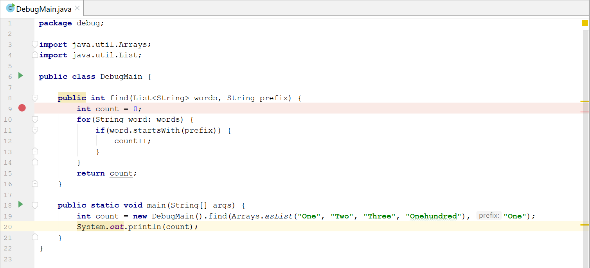
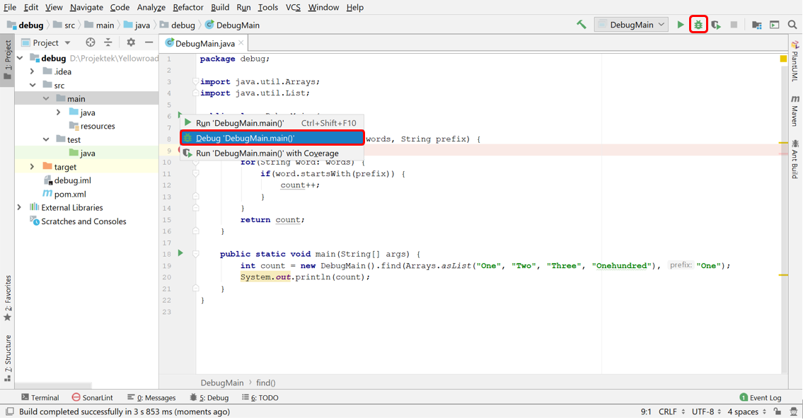
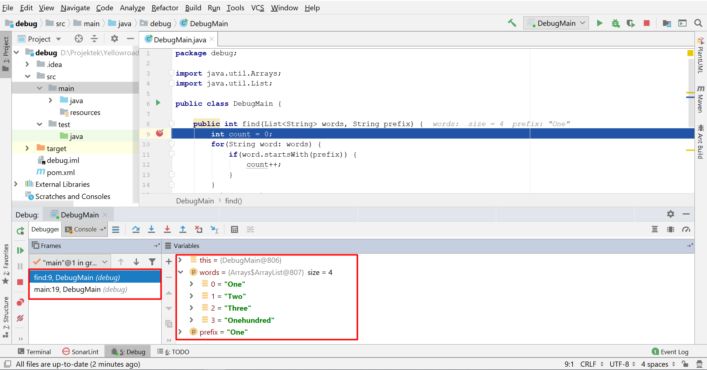
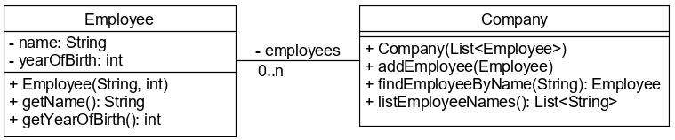

# Debug

A **Debugger** a fejlesztőeszköz által biztosított eszköz a hibakeresésre. 
Meg tudjuk állítani vele az alkalmazást, meg tudjuk vizsgálni annak belső 
állapotát sőt akár módosítani is tudjuk, valamint alkalmazásunkat utasításonként 
tudjuk léptetni.

Az alkalmazás megállításához **breakpointot** tudunk elhelyezni a forráskódban 
bármely utasítás mellett. Itt a JVM megáll, és a debuggertől várja a további 
utasításokat. Lehetőség van megállás után a változók, 
attribútumok vizsgálatára, valamint olyan utasításokat is kiadhatunk, amivel nem 
csak lekérdezhetjük, de akár meg is változtatjuk az objektum belső állapotát. 
Megállás után léptethetünk akár utasításonként is, hagyhatjuk tovább futni 
az alkalmazást, vagy újra leállíthatjuk breakpointtól függetlenül.

A debugger a teszteset futtatásakor is hasznos.

## Debugger az IntelliJ IDEÁ-ban

Az IDEA fejlesztőeszközben breakpointot a sor száma mellé kattintva tudunk elhelyezni. 
A megjelölt sor mellett egy piros pont látható, a háttere pedig halványpirosra vált.



Ahhoz, hogy a program felfüggessze a futását a megadott breakpointnál, debug módban 
kell elindítani. Ezt mindenhonnan, ahonnan futtatni is tudjuk megtehetjük: a `main()` 
vagy a tesztmetódus melletti zöld nyíl alól, eszköztárról és a _Run_ menüpontból 
is a bogár ikonra kattintva.



Elindítás után az editorban kékkel kijelölve láthatjuk a sort, amelyiken állunk, 
az IDE alsó részén részén pedig megjelenik a _Debugger_ ablak, ahol a call stacket 
és az aktuálisan elérhető változókat nézhetjük meg. A `+` jelre kattintva mi is adhatunk hozzá 
kiértékelendő kifejezéseket.
Amennyiben egy változó létező objektumra mutat, akkor lenyitva annak állapotát is követhetjük.



A Debugger ablak felső részén található gombokkal illetve a nekik megfelelő 
funkcióbillentyűkkel léptethetjük az alkalmazást, de mindig csak előre.


## Ellenőrző kérdések

* Mire való a fejlesztőeszköz debug funkciója?
* Mire való a breakpoint?
* Milyen lehetőségek vannak debug közben?

## Feladat

### Alkalmazottak

Készítsd el az UML alapján az `Employee` és a `Company` osztályt! Teszteld a 
`Company` metódusait a `CompanyMain` osztály `main()` metódusából!



Helyezz el breakpointot a `main()` metódus első utasítása mellett, és futtasd debug módban! 
Kísérletezz:

* Melyik léptetés mit eredményez?
* Mikor jelennek meg a lokális változók a debugger ablakban?
* El tudsz helyezni újabb breakpointokat a debugger futtatása közben is? 
Hogyan lehet azonnal a következő breakpointra ugrani?

### Csak pozitívan!

Hozz létre egy `NumberStatistics` osztályt egy `numbers` egész számokból álló lista 
attribútummal a `debug.numbers` csomagba! Az attribútumot konstruktorban kapja meg, és feladata a kapott listán 
mindenféle számítások elvégzése. Ezeket a számításokat már megírták, de sajnos 
valahol hiba csúszott mindegyikbe, mert nem adnak helyes eredményt.

Másold be az elkészült osztályba ezeket a metódusokat, majd írj egy `main()` metódust 
ezek tesztelésére! A debugger segítségével keresd meg és javítsd ki a hibákat!

```java
public int sumPositives() {
    int sum = 0;
    for(int n: numbers) {
        if(n != 0) {
            sum += n;
        }
    }
    return sum;
}

public int minDifferenceBetweenNeighbours() {
    int minDifference = numbers.get(0) - numbers.get(1) >= 0 ? numbers.get(0) - numbers.get(1) : numbers.get(1) - numbers.get(0);
    for(int i = 1; i < numbers.size() - 1; i++) {
        int actDifference = numbers.get(i) - numbers.get(i + 1);
        if(actDifference < minDifference) {
            minDifference = actDifference;
        }
    }
    return minDifference;
}
```

Elvárt eredmények:

* `new NumberStatistics(Arrays.asList(4, 8, -1, -2, 4, 5, 3)).sumPositives()` --> 24
* `new NumberStatistics(Arrays.asList(4, 8, -1, -2, 4, 5, 3)).minDifferenceBetweenNeighbours()` --> 1
* `new NumberStatistics(Arrays.asList(-3, -4)).sumPositives()` --> 0
* `new NumberStatistics(Arrays.asList(1)).minDifferenceBetweenNeighbours()` --> `IllegalStateException`

## Teszt

Melyik állítás HAMIS az alábbiak közül?

* A debugger futtatható `main()` metódusból és bármely teszt metódusból is.
* A debugger ablakban az IntelliJ IDEÁ-ban megtekinthető a call stack.
* A debugger ablakban az IntelliJ IDEÁ-ban megtekinthető az összes lokális változó aktuális értéke.
* [x] Az alkalmazás futása debug alatt csak a breakpointokon áll meg.
