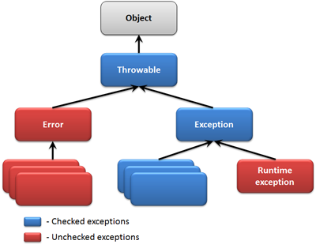

# Kivételkezelés

## Kivételek hierarchiája
A kivételek hierarchiájának tetején a `java.lang.Throwable` osztály áll. Két leszármazottja van:

*	`java.lang.Error` olyan hiba, amiből nem lehet visszaállni (nem kötelező kezelni)
		`java.lang.Exception` olyan kivétel, amit kezelni kell vagy lehet - ennek leszármazottja a `java.lang.RuntimeException`, melyet nem kötelező kezelni

## try-catch szerkezet

*	A `try` blokkban szerepelnek azok az utasítások amiket vizsgálni szeretnénk.
		A `catch` ág(ak)ban szerepel a kivételkezelés, a kivételt lekezelő utasítások.
    Itt `Exception`-öket kell megadni. Ha ezek egymástól függetlenek akkor mindegy a sorrend,
	ha van hierarchia az `Exception`-ök között akkor először a legspeciálisabbal kell kezdeni.
		A `finally` ág minden esetben végrehajtódik, tipikusan erőforrás lezárására használjuk

## Kivétel továbbdobása
A kivételt nem feltétlenül kezeljük, hanem tovább is dobhatjuk egy olyan modulnak, kódrészletnek, ami már tud a kivétellel mit kezdeni. Ehhez használjuk a `throw` kulcsszót vagy példányosítunk egy új kivételt, és ebbe a kivételbe burkoljuk, csomagoljuk az eredeti kivételt.

## Gyakori kivételek
*	`ArithmeticException` – például nullával való osztás esetén
		`ArrayIndexOutOfBoundsException` – tömb túlindexelés esetén
		`ClassCastException` – explicit konverziónál
		`NumberFormatException` – Stringből számot próbálunk konvertálni, de ezt nem lehet megcsinálni, mert pl. betű szerepel benne
		`StackOverflowError` – végtelen számú egymásba ágyazott metódushívás
		`OutOfMemoryError` – elfogy a JVM memóriája

## Ajánlott gyakorlati megoldások (best practice)
*	Ne szerepeljen üres `catch` ág. Egy kivétellel mindenképpen kezdeni kell valamit, legalább naplózzuk le, ha nem tudjuk lekezelni vagy továbbdobni.
		Mindenképpen használjunk minél speciálisabb kivételeket.
		Egy metódusban legfeljebb egy `try-catch` blokkot használjunk.
		Fontos, hogy vagy naplózzunk vagy dobjuk tovább a kivételt, egyszerre mind a kettőt ne tegyük, hiszen egy kivétel így többször is naplózásra kerülhet.
		Manapság a nem kezelendő kivételek az elterjedtebbek.

## Ellenőrző kérdések
* Hogyan néz ki a try utasítás?
* Hogyan működik a try utasítás?
* Hogyan lehet továbbdobni egy kivételt?

## Gyakorlat 1 - Polinom példa

Készítsen egy `Polinom` osztályt, amelynek segítségével tetszőleges polynomial értékét ki tudjuk számolni adott x értéknél.
A polinomot az együtthatóinak a tömbje írja le. A polinomot lehessen inicializálni az együtthatók tömbjével (`double[]`),
de lehessen inicializálni `String[]` -el is (pl. beolvasott értékek). Az osztálynak legyen egy
`public double evaluate(double x)` metódusa, amely adott x értéknél visszaadja a polynomial értékét. Valamint legyen getter az
együtthatók tömbjére.
A `double[]` paraméterű konstruktor dobjon `NullPointerException` kivételt, ha a paraméter null.
A `String[]` paraméterű konstruktor dobjon `NullPointerException` kivételt, ha a paraméter null,
valamint dobjon `IllegalArgumentException`-t ha az egyes `String`-ek nem alakíthatók `double` számmá.

### Mi az a polinom?

`https://hu.wikipedia.org/wiki/Polinom`

[rating feedback=java-exceptions-polinom]

## Bemeneti adatok ellenőrzése példa

Egy felhasználóktól nyert adatokat kell feldolgozni és a hibás sorokról jelentést készíteni.
Az bemeneti adatok sorai tartalmazhatnak megjegyzésbe tett sorokat is, tehát lehet benne adatsor és lehet megjegyzés sor.

Az adatsorok szerkezete: `sorszám, mértérték, mérésdátum`. Pl. `12, 34.5, 2014.05.22`.
A megjegyzésbe tett sorok ugyanúgy `,` karakterrel elválasztott három részből állnak, csak az első rész nem alakítható számmá.
Pl. M12, 12, 2014.01.01.
A hiba jelentés tartalmazzon bejegyzést minden olyan sorról, amely nem megjegyzésbe tett és hiba van benne.
A jelentés egy `List<String>` legyen, ahol a `String` tartalmazza a hibás sor sorszámát és a hiba kódját, `sorszam, hibakód` alakban.
Figyelem, a hibaüzenetben a sorban szereplő sorszámot kell kiírni, és nem azt a számot (indexet), amelyik pozíción szerepel az adott sor.

Hibakódok:

* 2: `WORDCOUNT_ERROR`, azaz a sor nem bontható 3 db `,` karakterrel elválaszható részre.
* 4: `VALUE_ERROR`, azaz a második rész nem `double` szám.
* 8: `DATE_ERROR`, azaz a harmadik rész nem `yyyy.MM.dd.` alakú dátum
* 12: `VALUE_AND_DATE_ERROR`: azaz egyszerre van `VALUE_ERROR` és `DATE_ERROR` is.

### Megoldáshoz további részletek

* Készíts egy `FaultList` osztályt, amelynek van egy `public List<String> processLines(List<String> lines)` metódusa
* A hibakódokhoz célszerű egy enumot definiálni
* Egy sor feldolgozására célszerű egy private metódust készíteni, ami visszaadja a sor feldolgozás eredményét
(az eredmény vagy a hibakódok valamelyike vagy `NO_ERROR` vagy `COMMENT`)

[rating feedback=java-exceptions-adatellenorzes]
