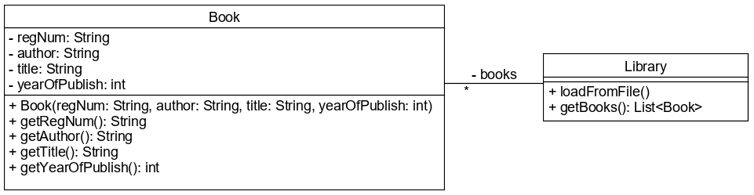

# Fájl olvasása Scannerrel

A `Scanner` osztály nem csak konzolról való olvasást tesz lehetővé, hanem szöveges 
fájlok feldolgozására is alkalmas. Ebben az esetben a `Scanner` konstruktorának a 
fájlt kell átadnunk, melyet a `Path` objektum reprezentál. Ezt létre tudjuk hozni 
a fájl elérési útvonalával:

```java
Scanner scanner = new Scanner(Path.of("books.txt"));
```

A fájl megnyitása közben több hiba is történhet, melyet kezelnünk kell. Például nem 
létezik a fájl, nincs jogosultságunk olvasni. Azaz a `Scanner` példányosítása `IOException` 
kivételt dobhat, melyet valahogy kezelnünk kell. A fájlokat és a `Scanner` példányt 
is használat után le kell zárni a `close()` metódussal. A Java képes ezeket 
automatikusan lezárni, amennyiben a kivételeket try-with-resources szerkezettel 
kezeljük, és a lezárandó objektumokat ennek a fejrészében példányosítjuk.

```java
try (Scanner scanner = new Scanner(Path.of("books.txt"))) {
    while(scanner.hasNextLine()) {
        String line = scanner.nextLine();
        System.out.println(line);
    }
}
catch (IOException ioe) {
    throw new IllegalStateException("Cannot read file", ioe);
}
```

A try blokk végén a `Scanner` példányon akkor is meghívódik a `close()` metódus, ha minden 
rendben lefutott, és akkor is, ha hiba történt. A `Scanner` lezárásával automatikusan 
lezáródik a megnyitott fájl is.

A fájl útvonalát mind relatív, mind abszolút elérési úttal megadhatjuk. Ha a fájl az 
alkalmazás részét képezi, akkor Maven használata esetén azt az erőforrásoknak 
fenntartott src\main\resources könyvtáron belül kell elhelyeznünk, és Path helyett a 
`Class` `getResourceAsStream()` metódusával tudjuk a fájlt megnyitni. Az itt elhelyezett 
fájlok ún. gyökérútvonallal is megadhatók, melyet mindig `/` jellel kezdünk. 
A /books.txt azt jelenti, hogy a projekt classpath gyökerében található books.txt fájl. 
Relatív útvonal esetén a viszonyítási pont az osztályt tartalmazó csomag lesz. Ha a 
`FileScannerMain` osztályunk a `training` package-ben van, akkor a "books.txt" útvonal 
az src\main\resources\training\books.txt fájlra mutat.

```java
try (Scanner scanner = new Scanner(FileScannerMain.class.getResourceAsStream("/books.txt"))) {
    while(scanner.hasNextLine()) {
        String line = scanner.nextLine();
        System.out.println(line);
    }
}
```

A `getResourceAsStream()` metódust az aktuális osztály neve + `.class` előtaggal 
kell hívni. Az útvonal megadása ebben az esetben rendszerfüggetlen, azaz a könyvtárak 
elválasztására mindig `/` jelet használunk. A metódus nem dob `IOException` kivételt, 
ezért a catch ág ebben az esetben nem kell, de a `Scanner` objektum automatikus 
lezárásához még mindig try-with-resources szerkezetben példányosítjuk.

## Ellenőrző kérdések

* Hogyan lehet szöveges fájlok olvasásához példányosítani a `Scanner` osztályt?
* Milyen kivétel keletkezhet, ha a fájl eléréséhez a `Path.of()` metódust használjuk, 
és ezt hogyan kezeljük?
* Hová kell elhelyezni a fájlt, ha az az alkalmazásunk része Maven használata esetén? 
Hogyan tudjuk ebben az esetben megnyitni?
* Hogyan zárjuk le a megnyitott fájlt olvasás után?

## Feladat

### Bakancslista

A bakancslistánkat egy szöveges fájlba írtuk, minden pontot külön-külön sorba. 
A bucketlist.txt a projekt gyökérkönyvtárában található. Listázd ki a fájl tartalmát 
a képernyőre a `BucketList` osztály `main()` metódusában! Amennyiben hiba 
történik a fájl megnyitásakor vagy olvasása közben, jelezd a hibát a felhasználónak!

### Könyvtár

Egy könyvtár nyilvántartása a könyvek leltári számát, szerzőjét, címét és a 
kiadás évét tartalmazza. Készíts egy `Book` osztályt, mely konstruktorában 
megkapja ezeket az adatokat! Minden adata lekérdezhető, de egyik sem módosítható. 
A `Library` osztály attribútumként egy `List<Book>`-ot tartalmaz. A `loadFromFile()` 
metódusa a classpath-on található books.csv fájlból tölti be a könyvek adatait. A fájl 
minden sora egy könyv adatait tartalmazza pontosvesszővel elválasztva.



**Tipp:** Könnyebb a fájl olvasása, ha mind a `;`-t, mind a sorvége karaktert beállítod a 
`Scanner` elválasztójaként. Ehhez használd delimiterként a `";|(\r\n)"` kifejezést!
