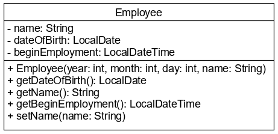

# Dátum és időkezelés a Java-ban (Java 8-tól)

Dátumok és időpontok kezelése minden programozási nyelven alapvetően fontos. A 
Java fejlődése során több jelentős változáson ment át a dátum-idő kezelés. Az 
első eszköz erre a `java.util.Date` osztály volt, ami mellé később egyfajta 
profiltisztítás miatt a `java.util.Calendar` osztály társult. A `Date` egy 
időpontot reprezentált, míg a `Calendar` szállította a dátumok kezeléséhez 
szükséges elemeket, mint például a hét napjainak neveit és még sok minden mást.
Ez azonban a gyakorlatban túl bonyolult lett, és ezért a Java 8 kiadásakor 
megjelentek a dátum és időkezelést együtt végző `java.time` csomag osztályai:

* `LocalTime`, mely csak időpontot tárol,
* `LocalDate`, mely csak dátumot tárol,
* `LocalDateTime` mely dátumot és időpontot is tárol.

Objektumai nem a szokásos `new` operátorral hozhatók létre, hanem statikus 
metódusokkal. Ezekkel a különböző paraméterezésű `of()` metódusokkal számok megadásával 
(év, hó, nap) hozhatók létre a szükséges objektumok. A hónapot akár olvashatóbb formában a 
`Month` enum használatával is megadhatjuk. Pl: `Month.JANUARY`.

```java
LocalDate date = LocalDate.of(2015, Month.JANUARY, 20);
LocalDate anotherDate = LocalDate.of(2015, 1, 20);

LocalDateTime dateTime = LocalDateTime.of(2015, Month.JANUARY, 20, 10, 15);
LocalDateTime anotherDateTime = LocalDateTime.of(2015, Month.JANUARY, 20, 10, 15, 30);

LocalTime time = LocalTime.of(10, 15);
```
 
Mindhárom osztály esetében rendelkezésünkre áll a `now()` metódus, amely a számítógép 
rendszeridejének megfelelő dátumot és/vagy időt adja vissza.

A Java képes a dátumok és idők olvasható megjelenítésére a nemzetközi szabványnak 
megfelelően, ezért ezek a típusok közvetlen kiírhatók.

```java
LocalDateTime localDateTime = LocalDateTime.now();
System.out.println(localDateTime); // 2015-01-20T10:15:30
```

Egyik osztály sem alkalmas időzónák kezelésére.

## Ellenőrző kérdések

* Mit tárol a `LocalDateTime` objektum?
* Hogyan lehet egy `LocalDate` vagy `LocalDateTime` objektumot létrehozni?
* Mire való a statikus `now()` metódus?
* Milyen pontossággal lehet az időt megadni?
* Mi a szerepe a `Month` enumnak?

## Feladat

### Employee

Egy olyan osztályt - `Employee` - akarunk létrehozni, amely egy alkalmazott 
felvételekor rögzíti a munkába álló főbb adatait. Rögziti a nevét `name`, 
születési dátumát `dateOfBirth` és a belépés pillanatát `beginEmployment`
(amikor az objektumot létrehozzuk). Az osztály konstruktorában adjuk meg a 
felvett adatokat, és ezekből a konstruktor létrehozza a tárolandó objektumokat.
Mivel a felvétel után csak a dolgozó neve módosítható, getter metódus mindegyik attribútumra kell,
de setter metódus csak a nevére szükséges.



Az osztály tesztelését az `EmployeeTest` osztály `main()` metódusában végezd el! Az
alkalmazott belépéséhez szükséges adatokat olvasd be, majd az objektum létrehozása 
után írd ki annak minden adatát!

[rating feedback=java-introdate-employee]

### Performance

Adott előadó fellépéseit szeretnénk nyilvántartani egy Java alkalmazásban, ehhez 
viszont szükségünk van egy, az adatokat rögzítő `Performance` osztályra. A fellépés 
dátumát `date`, jellegét `type`, és idejét `time` szeretnénk tárolni.
A beviteli primitív adatokból a konstruktor állítja össze a szükséges objektumokat.
Az egyes attribútumok természetesen lekérdezhetők, így getter metódus mindegyikre kell, 
de az adatok rögzítése után azok változtatására már ne legyen lehetőség,
azaz nincs szükség setter metódusokra.

A konstruktor formátuma:
```java
public Performance(int year, Month month, int day, String type, int hour, int minute)
```

Az osztály tesztelését a `PerformanceTest` osztály `main()` metódusában `System.out` 
kiírások formájában végezzük. Az objektum létrehozásához szükséges adatokat most nem kell 
beolvasnod a felhasználótól.

Tipp:

Sokszor hasznos lehet, ha - akár csak tesztelési célokra - egy osztály attribútumait név-érték párok formájában ki tudjuk iratni.
Próbáljuk ki, milyen szolgáltatást nyújt az IntelliJ IDEA ehhez! A már ismert generálás menüből válasszuk a _toString()_ menüpontot
és végezzük el a generálást, majd a tesztelés során hívjuk meg ezt a metódust a tesztelés alatt álló objektumon (`System.out`).

[rating feedback=java-introdate-performance]

## Teszt

Mely dátum- és időkezelő osztályok jelentek meg a Java 8-ban? (3 helyes válasz)

* `Date`
* [x] `LocalDate`
* [x] `LocalTime`
* [x] `LocalDateTime`
* `Calendar`

Hogyan NEM lehet egy `LocalDate` példányt létrehozni?

* `LocalDate.of(2017, 4, 17)`
* `LocalDate.now()`
* [x] `new LocalDate(2017, 3, 17)`
* `LocalDate.of(2017, Month.APRIL, 17)`

