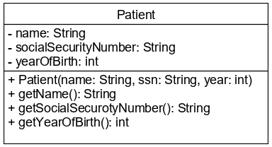
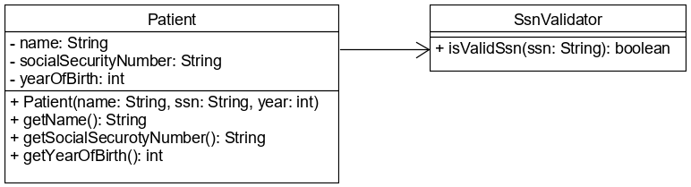

# Bevezetés a kivételkezelésbe

Kivételkezelést akkor használunk, ha fel akarunk készülni olyan esetekre, melyek 
normál működés esetén nem szoktak bekövetkezni. Fontos, hogy a kivételkezelést ne 
használjuk vezérlésre. Példák a kivételkezelésre:

* Hálózati kapcsolat megszűnik
* Hiba a fájlműveletek közben
* Nem értelmezhető paraméterek átadása metódushíváskor

Figyeljünk arra, hogy metódusokban ne használjunk speciális visszatérési értéket 
(pl.: `-1`, `0`, `null`) kivételes esetekben, hanem használjunk kivételkezelést.

## Teendők kivételes esetekben

A kivétel figyelmen kívül hagyható (nagyon ritkán). Például, ha le szeretnénk zárni 
egy erőforrást, ami már le van zárva. Ekkor a keletkezett kivétel figyelmen kívül 
hagyható, hiszen a cél az volt, hogy le legyen zárva az erőforrás.

Tovább dobhatjuk, delegálhatjuk a hibát, ha nem tudunk vele mit kezdeni, majd az 
alkalmazásunk egy másik pontján kezeljük.

Kezelhetjük, illetve javíthatjuk a hibát. Fontos, hogy a felhasználót értesítsük 
a keletkezett kivételről.

## Kivételek

A kivétel nem más, mint egy osztály. Vannak az osztálykönyvtárban előre megírt 
kivételek, de mi magunk is írhatunk saját kivétel osztályt. A leggyakrabban használt kivételek:

* `NullPointerException`
* `IllegalArgumentException`
* `IllegalStateException`

Kivételeket dobhatók a `throw` kulcsszóval, de le is kell példányosítani a kivételosztályt.

```java
throw new IllegalArgumentException("Wrong args!");
```

Kétféle kivételt különböztetünk meg: nem kezelendő illetve kötelezően kezelendő kivételeket.

### Nem kezelendő kivételek

Ezek az úgynevezett **unchecked** kivételek. Alapvetően nem látható, csak tesztek 
futtatása közben vagy a dokumentációból derülhet ki, hogy egy ilyen kivétel kiváltódhat.

### Kötelezően kezelendő kivételek

Kétféleképpen kezelhetjük a kötelezően kezelendő, azaz **checked** kivételeket. Tovább dobhatjuk, 
ezt a metódus fejlécében a `throws` kulcsszóval tehetjük meg, jelezvén, hogy a 
metódus közben kivétel keletkezhet.

```java
public void readFromFile(String fileName) throws IOException, FileNotFoundException{
    .
    .
    .
}
```

Másik megoldás, hogy úgynevezett try-catch szerkezettel kezeljük a kivételt, mely 
befoglalja a kiváltó utasítás(ok)at. Csak akkor használható, ha a körbezárt blokk 
dobhatja az adott kivételt.

```java
  public void divTwoNumbers(int a, int b) {
        try{
            int result = a / b;
            System.out.println("A hányados alsó egészrésze: " + result);
        } catch (ArithmeticException ae) {
            System.out.println("Aritmetikai hiba!");
        }
    }
```

## Ellenőrző kérdések

* Mi az a kivétel? Sorolj fel néhány példát!
* Mit tehetsz, ha egy kivétel dobódott?
* Hogyan tudsz kivételt dobni?
* Készíthetsz-e saját kivételosztályt?

## Feladat

### Rendelő 1

Készítsd el a `Patient` osztályt, mely tárolja a beteg nevét, TAJ számát és 
születési évét!



Konstruktorban ellenőrizd a paramétereket, és `IllegalArgumentException` 
dobásával jelezd a nem megfelelő értékeket!

A `name` nem lehet üres, a `yearOfBirth` pedig legalább 1900 kell legyen.
 

### Rendelő 2

Egészítsd ki a `Patient` osztályt, hogy a TAJ számot is ellenőrizze! Ehhez hozd 
létre az `SsnValidator` osztályt!



A TAJ számot a következő algoritmussal ellenőrizd: 
A TAJ szám egy kilenc számjegyből álló szám. 
A TAJ szám első nyolc számjegyéből a páratlan helyen állókat hárommal, 
a páros helyen állókat héttel szorozzuk, és a szorzatokat összeadjuk. 
Az összeget tízzel elosztva a maradékot tekintjük a kilencedik, azaz ellenőrző kódnak. 
Ha az ellenőrző kód nem egyezik, akkor ne fogadd el a TAJ számot!

Ne felejtsd el, hogy a számmá konvertálás kivételt dobhat!

[rating feedback=java-introexception-rendelo]

## Teszt

Milyen két csoportra bonthatók a kivételek?

* [x] checked, unchecked
* error, exception
* try, catch
