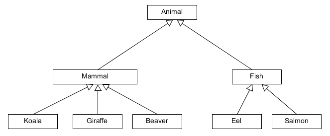

# Öröklődés

Az osztályok tervezésekor és újra felhasználásakor felmerülhet, hogyan lehetne bővíteni egy már meglévő osztály attribútumait, metódusait anélkül, hogy az eredeti osztályt módosítanánk, illetve hogyan tehetnénk bele közös kollekcióba a különböző típusú objektumokat, ha valamilyen szempontból közösen szeretnénk kezelni őket (például egy rajzon lévő összes vonal, ellipszis, téglalap stb.) Az első esetben egy általános osztályból készítünk speciálisabbat (specializáció), a második esetben a speciális osztályokat általánosítjuk (generalizáció).

Specializáció: Vehicle --> MotorVehicle --> Car --> Taxi

Generalizáció: (Koala, Giraffe, Beaver) --> Mammal --> Animal

Az általánosabb osztályt szülőnek, illetve ősnek, a speciálisabbat gyermeknek vagy leszármazottnak nevezzük.

A leszármazott az ős minden tagjával rendelkezik, amire az ős engedélyt ad, és még többel is rendelkezhet. A leszármazást a Javaban az `extends` kulcsszó jelöli, amely jól jellemzi, hogy a leszármazott tulajdonképpen az ős kiterjesztése.

```java
class Animal {
	  // ...
}

class Mammal extends Animal {
    // ...
}

class Koala extends Mammal {
    // ...
}
```

A Java nyelvben csak egyszeres öröklődés van. Ez azt jelenti, hogy egy osztálynak csak egy közvetlen szülője lehet, de akárhány gyereke. Közvetve vagy közvetlen, de minden osztály az `Object` osztályból származik. Azért látjuk, hogy egy általunk létrehozott új osztály olyan metódusokkal is rendelkezik, amiket nem írtunk bele, mert azokat az ősétől, az `Object`-től örökölte. (`equals`, `hashCode`, `toString`). Az osztályok és a köztük lévő öröklődési kapcsolatok egy fa szerkezettel ábrázolható.



## Osztályok közötti kapcsolatok

Láttuk, hogy a specializáció azt jelenti, hogy az utód is mindig egy ős. Azaz, a koala egy emlős, az emlős egy állat. Ezt **is-a** kapcsolatnak nevezzük, és öröklődésre utal. (a Koala *is a* Mammal)

Amikor az osztály azért tud valamit, mert egy része tud valamit, akkor az nem öröklődés, hanem tartalmazási kapcsolat, azaz kompozíció. Ilyenkor az osztály attribútumként tartalmaz egy másik osztályt. Ezt az angol kifejezés után **has-a** kapcsolatnak hívjuk. (the Person *has a* Name)

Amikor csak lehetséges, használjunk kompozíciót öröklődés helyett, mert azt attribútumban tárolt objektum futási időben dinamikusan cserélhető.

## Ellenőrző kérdések

* Mire való az öröklődés?
* Amennyiben nem írjuk ki, öröklődnek-e valahonnan a Java osztályok?
* Hogyan kell Javaban öröklődést definiálni?
* Mi a különbség az is-a és has-a kapcsolatok között?
* Mit használjunk inkább öröklődés helyett? Miért?

## Gyakorlat 1

###`Person`, `Employee`, `Boss` és `BigBoss` osztályok

Ezek egy munkahelyi hierarchiát reprezentálnak, a fenti sorrendben egymásból öröklődő osztályok.
Jelen esetben a `Person` osztályt nem is példányosítjuk, ez az alatta levő osztályok egyfajta
absztrakciójának tekinthető.
A különböző alkalmazottak fizetését eltérő módon számítjuk. Míg az `Employee` alapfizetéssel rendelkezik,
a `Boss` esetében az alapfizetéshez hozzáadódik a vezetői pótlék
(beosztottak száma * LEADERSHIP_FACTOR * alapfizetés), míg a `BigBoss` esetében ehhez hozzáadódik
egy vezetői prémium is (`bonus`).

`Person` osztály `String name` és `String address` attribútumokkal

Publikus metódusok:

```java
public Person(String name, String address)
public void migrate(String newAddress)
```

`Employee` osztály  `double salary` attribútummal

Publikus metódusok:

```java
public Employee(String name, String address, double salary)
public double getSalary()
public void raiseSalary(int percent)
```

`Boss` osztály `LEADERSHIP_FACTOR = 0.1` és `int numberOfEmployees` attribútummal

Publikus metódusok:

```java
public Boss(String name, String address, double salary, int numberOfEmployees)
public double getSalary()
public int getNumberOfEmployees()
```

`BigBoss` osztály `double bonus` attribútummal

Publikus metódusok:

```java
public BigBoss(String name, String address, double salary, int numberOfEmployees, double bonus)
public int getNumberOfEmployees()
public double getBonus()
public double getSalary()
```

[rating feedback=java-introinheritance-personemployeeboss]

## Gyakorlat 2

### `Item`, `Basket` és `ShoppingBasket` osztályok, öröklődés helyett kompozíció

Az öröklődés mellett/helyett kompozíció is alkalmazható, ahol az alkotó osztályok egymás szolgáltatásait használják ki új
funkciók megvalósítására. Itt az alap `Basket` osztály `Item` objektumokat tárol, és a `ShoppingBasket` osztály
attribútumként tárol egy `Basket` objektumot, magasabb szintű és részben másféle funkciók kiszolgálására.

`Item` osztály `String barcode`, `double nettoPrice`, `int vatPercent` attribútumokkal

Publikus metódusok:

```java
public double getTaxAmount() // a nettoPrice és a vatPercent alapján kiszámolja az adó összegét
public double getNettoPrice()
public String getBarcode()
public String toString()  // generált string reprezentáció
```

`Basket` osztály `List<Item> items` attribútummal

Publikus metódusok:

```java
public void addItem(Item item)
public void removeItem(String barcode)
public void clearBasket()  //a Basket ürítése
public List<Item> getItems()  // az Item lista másolatát adja vissza!
```

`ShoppingBasket` osztály `Basket basket` attribútummal

publikus metódusok:

```java
 public void addItem(Item item)
 public void removeItem(String barcode)
 public double sumNettoPrice() // az összes tételre
 public double sumTaxValue()  // az összes tételre
 public double sumBruttoPrice()
 public void checkout() // befejezzük a vásárlást, a kosár ürítése
 public void removeMostExpensiveItem() // kikeresi és eltávolítja a kosárból a legdrágább tételt
```

[rating feedback=java-introinheritance-itembasketshoppingbasket]

## Bónusz feladat

Jelenleg az alkalmazásban nincsen hibavédelem, minden paramétert elfogadunk ahogy van. Nézd végig a metódusokat,
és ahol indokolt, kivételdobásokkal védd meg a hibás adatbeviteltől.
