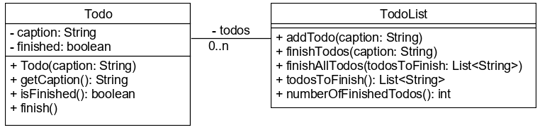

# Bevezetés a metódusok használatába

A metódusok az objektum attribútumain dolgoznak. Az alapján, hogy segítségével 
adatokat nyerünk ki vagy módosítunk megkülönböztetünk lekérdező és állapot módosító metódusokat. 
A **getter** metódusok mind lekérdezők, míg a **setter** metódusok mind állapot módosítók.

## Metódusok felépítése

A metódusoknak van **feje** (láthatósága, visszatérési típusa, neve, formális 
paraméterlistája) és **törzse**. Az imperatív programozás eszköze, azaz törzse 
lokális változó deklarációkat és utasításokat tartalmaz. Egy metódus mindig 
hozzáfér az őt tartalmazó osztály attribútumaihoz. Konvenció szerint egy metódus 
neve olyan igét tartalmaz, amely arra utal, hogy mit csinál. Ez lekérdező 
metódusok esetén leggyakrabban `get`, `find`, `query`, állapot módosító metódusok 
esetén `set`, `change`, `modify`.

Egy metódus hívhat más metódusokat, amelyek lehetnek saját példányon belül, 
(objektum) attribútum vagy lokális (objektum) változó látható metódusai.

```java
private List<Double> numbers;

public double getSumOfElements(){ // Fej: láthatóság, visszatérési típus, név, (paraméterlista)
	double sum = 0; // Lokális változó
    for (double a: numbers) {
        sum = sum + a;
    }
    return sum;
}

public double getAverageOfElements(){
    if (numbers.isEmpty()) { // Attribútum metódusa
    	return 0.0;
    }
    return getSumOfElements() / numbers.size(); // Saját metódus és attribútum metódusa
}
```

A lokális változók a deklarációtól kezdve azon blokk végéig érhetőek el, amelyikben 
deklaráltuk őket. A fenti példában a `sum` változó a `getSumOfElements()` metódus végéig, 
de az `a` változó csak a ciklus végéig létezik.

## Paraméterek

Metódus deklarációjakor egy formális paraméterlistát adunk meg, ami azt jelenti, 
hogy ezek tényleges értéke csak futási időben derül ki, de rájuk a metóduson belül 
az itt adott névvel hivatkozhatunk. A paraméterlista üres is lehet, de a 
metódusfejbe ekkor is ki kell tenni a kerek zárójeleket. Metódus hívása a nevével 
és az aktuális paraméterek megadásával lehet. Ha a metódus ad vissza valamilyen értéket, 
azt felhasználhatjuk kifejezésben. Az aktuális paraméterek megadása pontosan 
olyan sorrendben történik, mint amilyen a formális paraméterek sorrendje.

Deklaráció:

```java
public String sayHappyBirthdayTo(String firstName, String lastName, int age) {
	return "Boldog " + age + ". születésnapot " + lastName + " " + firstName + "!";
}
```

Hívás:

```java
public void otherMethod(){
	  System.out.println(sayHappyBirthdayTo("Margit", "Balogh", 23)); // OK
    System.out.println(sayHappyBirthdayTo("Ferenc", "Tercsik", 24.1)); // Nem jó a 3. paraméter típusa
    System.out.println(sayHappyBirthdayTo(28, "Anna", "Tóth")); // Nem jó a sorrend
}
```

Névütközés van, ha a formális paraméter neve egyezik egy attribútum vagy lokális változó 
nevével. Az attribútumra hivatkozhatunk a `this` minősítővel, de a lokális változó sajnos 
elfedi a paramétert, ezért az nem lesz elérhető.

```java
private String name = "John";

public void sayHello(String name){
    String name = "Anonymous"; // Elfedi a paramétert
    System.out.println("Hello " + name); // Hello Anonymous
    System.out.println("Hello " + this.name); // Hello John
}
```

Mi történik, ha a paraméteren változtatunk?

A Java nyelvben minden paraméter érték szerint adódik át. Ez azt jelenti, 
hogy híváskor az aktuális paraméter értéke átmásolódik a formális paraméterként 
megadott változóba. Ha változtatunk az értékén, akkor ez a formális paraméter 
változó módosul, az eredeti változót nem érinti. **DE VIGYÁZZ! Ha osztály típusú 
a paraméter, akkor a referenciáját másolja át, vagyis a metódus az eredeti objektumhoz 
fér hozzá.** A legjobb, ha a paramétereken sosem változtatsz.

## Speciális metódusok

`String toString()`: az objektum szöveges reprezentációját adja vissza. Minden 
osztályban van, akkor is, ha nem írjuk bele, csak akkor alapértelmezett megjelenítése 
(`osztálynév@furcsa karaktersorozat`) lesz, amely nem túl informatív. Ha bármi mást 
szeretnénk megjeleníteni, akkor ezt a metódust újra kell írnunk. Ebben segítségünkre 
van a fejlesztőkörnyezet, amely képes legenerálni egy olyan `toString()` metódust, 
amely az objektum állapotát jeleníti meg olvasható formában, de akár egyedit is írhatunk. 
Mivel már létező metódust szeretnénk felülírni, ezért fölé tegyük ki a `@Override` 
szót (annotációt). A `System.out.println()` metódus mindig ezt a metódust hívja anélkül, 
hogy azt explicit módon meghívnánk.

```java
@Override
public String toString(){
	return "Nevem " + this.name;
}
```

Az IntelliJ IDEA a leggyakrabban használt metódusok elkészítésében nagy segítséget nyújt. Nem csak 
a konstruktor, hanem a getter és setter metódusok automatikus generálására is képes, valamint az olyan 
speciális metódusokat, mint a `toString()` is el tudja készíteni egy alapértelmezett 
implementációval. Utólag természetesen bármelyik legenerált metódust átírhatjuk.

A `Generate` menüt az `ALT + Ins` billenytűkombinációval érhetjük el.

## Ellenőrző kérdések

* Tipikusan hogyan épül fel egy metódus?
* Mit tartalmazhat egy metódus törzse?
* Milyen metódusokat különböztetünk meg?
* Hogyan tudjuk egy objektum állapotát kiírni legegyszerűbb módon újrafelhasználhatóan?

## Feladat

### Alkalmazottak

Készítsd el az `Employee` osztályt, amelyben az alkalmazott nevét (`name`), 
belépés évét (`hiringYear`) és az egész értékű fizetését (`salary`) tárolod attribútumként! 

Az osztály példányosításakor mindhárom adatot meg kell adni,  konstruktort ennek megfelelően készítsd el!

Minden attribútumához készíts gettert, valamint a `name` attribútumhoz settert is! A fizetése 
utólag emelhető, ezért készíts egy `raiseSalary()` metódust, amely paraméterként 
megkapja az emelés mértékét forintban, és ennek megfelelően módosítja a fizetést!

Generáld le az IDE segítségével a `toString()` metódust! Milyen alakban jelenik meg egy objektum állapota? 
Teszteld az osztály metódusait az `EmployeeMain` osztály `main()` metódusában!

### TodoList

Készíts egy `intromethods.TodoList` osztályt, mely egy tennivaló listát kezel!

Legyen egy `intromethods.Todo` osztály, melynek `finish()` metódusa a `finished` 
attribútum értékét `true` értékre állítja!

A `TodoList` osztály egy `List<Todo>` típusú attribútumként tárolja a tennivalókat.



A `TodoList` metódusai:

* `addTodo()` - felvesz egy új tennivalót a listába
* `finishTodos()` - az összes olyan tennivalót befejez, melynek a neve
megegyezik a paraméterként átadott névvel
* `finishAllTodos()` - egyszerre több tennivalót lehet befejezni
* `todosToFinish()` - visszaadja a befejezendő tennivalók neveit
* `numberOfFinishedTodos()` - visszaadja a befejezett tennivalók számát

Teszteld a `intromethods.TodoListMain` `main()` metódusából.

[rating feedback=java-intromethods-todolist]

### `Todo` `toString()` metódus

Készíts `toString()` metódust a `Todo` osztályban, mely visszaadja a tennivaló nevét,
és zárójelben megjeleníti, hogy be van-e fejezve.

Készíts `toString()` metódust a `TodoList` osztályban, mely visszaadja a tennivalókat
szövegesen. Delegáld a hívást az `ArrayList` `toString()` metódusának.

[rating feedback=java-intromethods-todoliststring]


## Teszt

Mely főbb részekből áll egy metódus?

* fej és láb
* [x] fej és törzs
* törzs és láb
* fej, törzs és láb

Az `Employee` osztálynak az `int year` attribútuma a belépés évét tartalmazza. A 
`int getWorkLength(int year)` metódusának az a feladata, hogy visszaadja, hogy a paraméterül kapott évig összesen 
hány évet dolgozott az alkalmazott. Hogyan lehet ezt kiszámítani?

* Nem lehet, mert a formális paraméter és az attribútum neve sosem lehet ugyanaz.
* `this.year - year`
* `object.year - year`
* [x] `year - this.year`

Hogyan lehet a `Student` osztály `move()` metódusát meghívni?

```java
public class Student {
    private String name;
    private String city;
    private String street;
    private int numberOfHouse;
    //Constructor, getters
    public void move(String street, int numberOfHouse, String city) {
        //Method body 
    }
}
```

* A paramétereket az attribútum sorrendjében kell megadni: `student.move("Debrecen", "Xantus utca", 5)`
* A paramétereket a formális paraméterlista sorrendjében kell megadni, de 
amelyik nem változik, azt nem kötelező: `student.move("Xantus utca", 5)`
* A paramétereket a formális paraméterlista sorrendjében kell megadni, kötelezően 
mind: `student.move("Xantus utca", 5, "Debrecen")`
* A paraméterek tetszőleges sorrendben megadhatók, csak jelezni kell, hogy melyik 
paraméterbe kerüljön: `student.move(city: "Debrecen", street: "Xantus utca", numberOfHouse: 5)`
