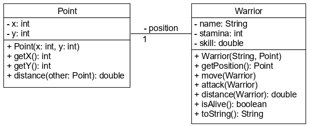

# `Math` és `Random` osztály

## Math osztály

A `Math` osztály matematikai konstansokat és függvényeket tartalmaz. Mind statikus, 
ezért mind az osztálynév minősítővel használjuk.

### Tartalma:

- E, PI
- Szögfüggvények
- Kerekítő függvények
- Hatvány, exponenciális és logaritmikus függvények
- Abszolútérték, minimum, maximum

```java
double squareRoot = Math.sqrt(5);
double perimeterOfCicle = Math.PI * r * 2;
```

### Ötletelj!

A `Math.round()` metódus a paraméterként kapott lebegőpontos számot mindig a legközelebbi egészre kerekíti. 
Hogyan kerekítenél egy lebegőpontos számot pontosan 3 tizedes jegyre?

## Random osztály

Véletlenszámok generálására használható a `Random` osztály. Mivel a számítógép nem 
képes kockát dobálni, csak az általunk kijelölt műveleteket tudja végrehajtani, 
ezért a kapott számok ténylegesen nem véletlenszerűek, hanem ún. **pseudorandom** számok. 
Ez azt jelenti, hogy a véletlenszámot előállító függvény kap egy bemeneti értéket, 
és valamilyen műveletsorozat végeredményeként visszaad egy másikat. Ha nem tudjuk, 
pontosan milyen érték ment be, akkor azt sem tudjuk megmondani, milyet kapunk vissza, 
azonban ha tudjuk, akkor pontosan kiszámítható a visszatérési értéke. Éppen ezért a `Random` 
osztályt kétféleképpen is példányosíthatjuk: vagy paraméter nélkül, és akkor véletlennek 
tűnő számot kapunk vissza, vagy egy kezdőértékkel, amelyet **seed** változónak nevezünk. 
Ekkor a működése determinisztikussá válik, így tökéletes teszteléshez.

Példányosítás után nemnegatív egész véletlenszámot a `nextInt()` metódussal generálhatunk. 
Ha a felső határt is meg akarjuk kötni, azt paraméterként kell átadnunk. 0 és 1 közötti 
lebegőpontos számot a `nextDouble()` metódussal generálhatunk.

```java
Random rnd = new Random();
int randomNumber = rnd.nextInt(); //0, 1, ... Integer.MAX_VALUE közül egy egész
int randomIntTo10 = rnd.nextInt(10); //0, 1, 2, ... 9 közül egy egész
double randomPossibility = rnd.nextDouble();
```

### Ötletelj!

- Hogyan generálnál -10 és 20 közötti egész véletlenszámot?
- És -3 és 3 közötti lebegőpontosat?

## Ellenőrző kérdések

* Milyen attribútumokat és metódusokat tartalmaz a `Math` osztály?
* Mi a pseudorandom és seed fogalma?
* Milyen metódusokat tartalmaz a `Random` osztály?

## Feladat

### Ha harc, hát legyen harc!

Készítsd el egy játék szereplőit! Minden szereplőnek van neve, életereje, ügyessége és pozíciója. 
A konstruktorban csak a nevét és a pozícióját kapja meg, az életereje 20 és 100 között 
generálódik véletlenszerűen, az ügyessége pedig egy lebegőpontos szám 0 és 1 között 
szintén véletlenszerű induló értékkel. Az ügyessége annak a valószínűsége, hogy egy harc során eltalálja az 
ellenfelét.



Metódusai:

* `move()`: a harcos pozíciója a kapott `Point` irányába elmozdul eggyel. Csak szomszédos cellába léphet, tehát 
csak fel, le, jobbra, balra vagy átlósan 1-et.
* `distance()`: visszaadja, hogy a paraméterül kapott karaktertől milyen messze van. 
A tényleges számítást a `Point` osztály `distance()` metódusában készítsd el, itt csak delegáld a feladatot!
* `attack()`: generálj egy véletlenszámot, és ha az kisebb, mint az ügyessége, akkor 
egy 1-3 közötti egész véletlenszámmal csökkentsd az ellenfél életerejét!
* `isAlive()`: igazat ad vissza, ha a harcos még életben van, különben hamisat.
* `toString()`: a harcos adatait az alábbi formában adja vissza: `név: (pozíció) életerő

A játék menetét a `Game` osztály `main()` metódusában szimuláld! Először hozz létre 
két harcost, akik harcolni fognak. A harchoz azonos pozíción kell lenniük, ezért 
egymás felé mozognak, míg el nem érik egymást. Amikor ez megtörténik, 
egymásra támadnak felváltva, míg valamelyikük meg nem hal.

Minden fordulóban mindkét harcos mozoghat, illetve támadhat. Jelenítsd meg a játék menetét, 
azaz minden forduló után írd ki a harcosok állapotát a képernyőre, a játék végén pedig hirdess 
győztest!

Példa kimenet:
```text
1. round
Joachim: (5,7) 47
Kahles: (1,9) 58
2. round
Joachim: (4,8) 47
Kahles: (2,8) 58
...
Winner: Kahles: (3,8) 51
```

### Kerekítési pontatlanságok

Generálj ezer lebegőpontos véletlenszámot öt tizedesjegyig egy tömbbe, értékük legyen maximum egymillió.
Add össze őket, majd kerekítsd a matematika szabályai szerint, valamint
kerekítsd le egyesével őket, és add össze a kerekített értékeket. Hasonlítsd össze a két eredményt.
Futtasd le ciklusban 100-szor, és vedd a kerekítési különbségek átlagát.

A `math.RoundingAnomaly` osztályba dolgozz.

Külön metódusba szervezd:

* Számok generálását egy tömbbe: `double[] randomNumbers(int size, double max, int scale)`
* Összeadást majd kerekítést `double roundAfterSum(double[] numbers)`
* Kerekítést, majd összeadást: `double sumAfterRound(double[] numbers)`
* Különbség számolást: `double difference(int size, double max, int scale)`. Ezt a metódust kell a `main`
	metódusból 100-szor meghívni, és a visszaadott értékeket átlagolni. Ez a metódus hívja az előző
	hármat úgy, hogy először legenerál egy tömböt, majd ugyanazzal a tömbbel hívd meg a `roundAfterSum`,
	majd a `sumAfterRound` metódusokat. Majd a két metódus által visszaadott érték különbségével kell visszatérni.

A ciklusban futtatást (100-szor) implementáld a `main()` metódusban.

[rating feedback=java-math-kerekites]

## Teszt

Hogyan lehet 1 és 5 közötti egész véletleszámot generálni a határokat is beleértve?

* `Random.nextInt(5) + 1;`
* `Random.nextInt(6);`
* [x] `new Random().nextInt(5) + 1;`
* `new Random().nextInt(6);`

Hogyan lehet egy `x` egész szám négyzetgyökét kiszámolni?

* [x] `double y = Math.sqrt(x);`
* `double y = new Math.sqrt(x);`
* `int y = Math.sqrt(x);`
* `int y = new Math.sqrt(x);`
