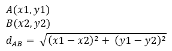
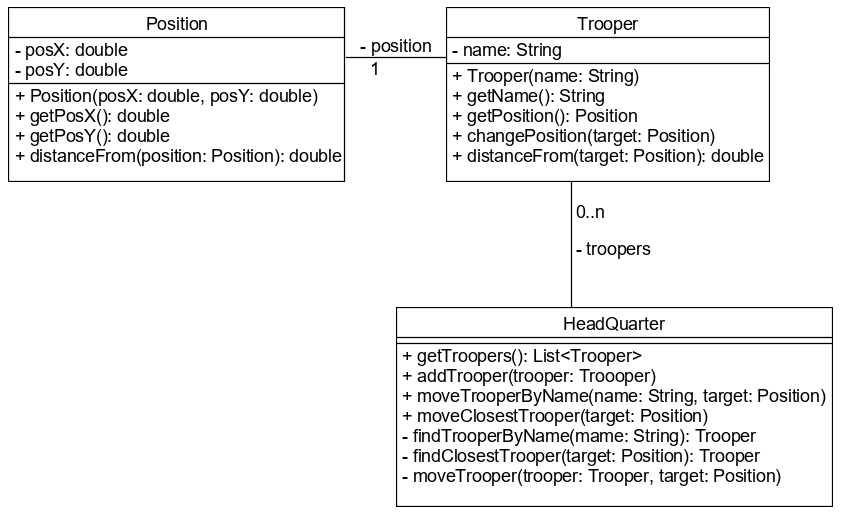

# Értékmásolás szerinti paraméterátadás

A Java nyelvben mindig értékmásolás szerinti paraméterátadás van: a híváskor 
átadott aktuális paraméter értéke (ha referencia változó, akkor ez a referencia) 
átmásolódik a formális paraméterbe, amely csak a metóduson belül érhető el.

```java
public void tryChangeValues(int yearOfBirth, String name, List<String> courses) {
  yearOfBirth = 1970;
  name = "John";
  courses.add("Java");
  // vagy courses = new ArrayList<>();
  
}
```

Hívása:

```java
List<String> courses = new ArrayList<>();
int originalYearOfBirth = 1980;
String originalName = "Jack";

tryChangeValues(originalYearOfBirth, originalName, courses);
```

## Visszahatás

Primitív és immutable objektumok esetén a metóduson 
belül tett változtatások nem hatnak vissza a hívó félre, azaz nem módosítják az 
eredeti változóban tárolt értéket, de már referenciák átadásakor bizony az 
eredeti objektumhoz fér hozzá a metódus.

Az `originalYearOfBirth` változó értéke 1980, az `originalName` változó értéke 
"Jack" marad. A `courses` változóban tárolt referencia sem változik, de a listába 
belekerült egy új elem.

Amennyiben a teljes listát egy újra cseréljük, szintén nincs visszahatás, hiszen magát a 
kapott referenciát cseréljük le. Visszahatás csak akkor lehetséges, ha a kapott 
referencián át elérhető objektum állapotát módosítjuk. Ilyen módosítást tapasztalhatunk 
az `Arrays.sort()` metódus esetén, amely a paraméterként kapott tömb elemeinek sorrendjét 
változtatja meg.

A legjobb gyakorlat, ha a paramétereken sosem módosítunk a metódusban, csak ha kifejezettképp 
ez a cél.

## Mi történik a memóriában?

Egy metódus hívásakor a stacknek az adott metódus számára fenntartott területére a 
formális paraméterekbe átmásolódnak az aktuális paraméterek értékei, ami - mint 
láttuk - lehet konkrét érték és referencia is. A metódus ezután csak ezen értékekhez, 
illetve ezen referenciákkal mutatott objektumokhoz fér hozzá.

Ha adott az alábbi két osztály, tudod követni, mi történik a memóriában?

```java
public class Main {

    public static void main(String[] args){
        int a = 16;
        int b = 43;
        Person adam = new Person("Adam");
        int c = doIncAndSum(a, b);
        System.out.println(a); //16
        System.out.println(b); //43
        System.out.println(c); //61
        System.out.println(adam.getName()); //"Adam"
        changeName(adam);
        System.out.println(adam.getName()); //"Peter"
    }

    public static int doIncAndSum(int x, int y){
        x++;
        y++;
        int result = x + y;
        return result;
    }

    public static void changeName(Person person){
        person.setName("Peter");
    }
}

class Person {

    private String name;

    public Person(String name){
        this.name = name;
    }

    public String getName(){
        return name;
    }

    public void setName(String name){
        this.name = name;
    }
}
```


## Ellenőrző kérdések

* Mi az az értékmásolás szerinti paraméterátadás?
* Javában hogyan történik a paraméterátadás? Magyarázd el primitív és osztály típusú paraméterek esetén is!
* Képes-e a metódus a paraméterként kapott objektum állapotát módosítani?

## Feladat

### Katonák

Hozz létre egy `Position` immutable osztályt, mely egy síkbeli pontot reprezentál! 
A pont távolságát egy másiktól a `distanceFrom()` metódusa adja vissza.

Két pont távolságát síkban az alábbi képlettel lehet kiszámítani:



A `Trooper` 
osztály egy gyalogos adatait tartalmazza. A gyalogos tudja változtatni a pozícióját, 
illetve meg tudja mondani, hogy egy adott ponttól milyen távol van. A `HeadQuarter` 
tartalmazza a gyalogosok listáját. Ezen osztály irányítja őket, valamint információt szolgáltat róluk. 
Az `addTrooper()` metódussal egy katonát lehet áthelyezni a panacsnokság alá.
A `moveClosesTrooper()` a katonák közül a legközelebbit küldi a megadott pozícióra, 
míg a `moveTrooperByName()` egy adott nevű katonát. A mozgatandó katona megtalálását és 
áthelyezését privát segédmetódusok végzik.



Minden publikus metódus ellenőrizze a paraméterként kapott adatokat. Objektum sehol 
sem lehet `null`, illetve a `Trooper` neve nem lehet üres. Hibás paraméter esetén a metódus dobjon 
`IllegalArgumentException` kivételt!

Mely metódusoknak van és melyeknek nincs visszahatása?

