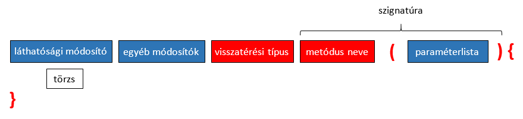

# Metódusok

A Java metódusok két fő részből állnak: fej és törzs.

A fej tartalmazza a láthatósági és egyéb módosítókat, a visszatérési érték típusát, a metódus nevét, a formális paraméterlistát és a metódus által dobható kivételeket. Amennyiben nincs visszatérési érték, akkor ezt a `void` kulcsszóval jelezzük. A metódus törzse tartalmazza az utasításokat.  Ezek mindig a `{}` jelek közé kerülnek.

Láthatósági módosító a `public`, `protected` és `private`, mely meghatározza, hogy mely más osztályok férhetnek hozzá a metódushoz. A metódus neve lehetőleg ige legyen, és ha több szóból áll, akkor az elsőt kivéve minden szót nagy kezdőbetűvel írunk (camelCase).

A formális paraméterlistában a paraméterek vesszővel elválasztva szerepelnek. Minden paraméternek van típusa és neve, de itt is megadhatunk módosítókat, mint például a `final` kulcsszó. Híváskor fontos a formális paraméterek száma, típusa és sorrendje, hiszen ez alapján köti össze a fordító a konkrét értéket a paraméter változóval. Ez alól van egy kivétel, a varargs, amelynél sok ugyanolyan típusú érték is átadható a metódusnak, és ezeket tömbként érhetjük el a metódus belsejéből. Mivel előre nem tudhatjuk, mennyi aktuális paraméter tartozik ebbe a tömbbe, ezért varargs kizárólag az utolsó formális paraméter lehet.



(A piros elemek kötelezőek, a kékek opcionálisak.)

A metódus mindig implicit megkapja az objektum referenciáját is (melyen meg lett hívva), amelyhez a `this` kulcsszóval férhetünk hozzá. Ezt aztán felhasználhatjuk ahhoz, hogy elérjük az objektum attribútumait, ha esetleg névütközés van valamelyik paraméterrel, illetve vissza is adhatjuk.

```java
private List<String> names;

public void addElementsWithA(String... names) {
    for (String name: names){
        if (name.startsWith("A")) {
            this.names.add(name);
        }
    }
}
```

Visszatérési érték típusát a fejben deklaráltuk, a konkrét értékét pedig a metóduson belül a `return` utasítás után kell megadnunk. A `return` utasítás azonnal kiugrik a metódusból, így utána már nem írhatunk további utasításokat (erre a fordító is figyelmeztet). Ha a metódus ad vissza valamilyen értéket, akkor minden ágon kell szerepelnie `return` utasításnak, de ha nem ad vissza értéket, akkor is elhelyezhetünk a törzsben üres `return`-t.

## Ellenőrző kérdések

* Mi a metódusok felépítése?
* Mi a visszatérési típus megadás olyan metódusnál, ami nem ad vissza értéket?
* Létezik paraméter nélküli metódus? Mi értelme van?
* Hogyan próbálja meg a Java az aktuális és a formális paramétereket megfeleltetni egymásnak?
* Milyen utasítás segítségével ad vissza értéket a metódus?
* Lehet egy olyan metódusban return utasítás, melynek a visszatérési típusa `void`?
* Lehet-e egy metódusban több return utasítás?
* Mit jelent az implicit paraméter fogalma?

## BodyMass osztály

Készíts egy `BodyMass` osztályt, amely testtömegindexet számol.
Adatai: tömeg (kilogramban megadva), magasság (méterben megadva).

Publikus metódusai:

* Getterek (`getWeight`, `getHeight`)
* `double bodyMassIndex()`: visszaadja a testtömegindexet,
használja a következő képletet: tömeg osztva a magasság négyzetével.
* `BmiCategory body()`: visszaadja a testalkatot (`BmiCategory` legyen egy enum):
    * ha a bmi (bodymassindex) < 18.5, akkor `BmiCategory.UNDERWEIGHT`
    * ha bmi > 25, akkor `BmiCategory.OVERWEIGHT`
    * különben `BmiCategory.NORMAL`
* `boolean isThinnerThan(BodyMass)`: igazat ad, ha a példányom bmi-je kisebb,
mint a paraméterként kapott példányé

[rating feedback=java-methodstructure-bodymass]

## Pendrives osztály

Készíts egy `Pendrives` osztályt, amely metódusaival pendrive-ok közül lehet kikeresni a megfelelőt.
A feladat részeként készíts egy `Pendrive` osztályt is.

A `Pendrive` tagjai:

* attribútumai: `name`, `capacity`, `price`. A kapacitás egész szám Gb-ben megadott érték. Az ár egész szám forintban megadott érték.
* Legyenek getterei az attribútumokra.
* Legyen `String toString()` metódusa, amely egy Stringbe összefűzve adja vissza a pendrive adatait.
* Legyen `void risePrice(int percent)` metódusa, amely megadott százalékkal megemeli a pendrive árát.
* Legyen `int comparePricePerCapacity(Pendrive)` metódusa, amely összehasonlítja a példányt egy paraméterként kapott másik
példánnyal az ár/kapacitás alapján. Az eredmény 1 legyen, ha az aktuális példány ár/kapacitása nagyobb, az eredmény -1 legyen
ha a paraméterként kapott példányé nagyobb, és az eredmény 0 legyen, ha egyformák.
* Legyen egy `boolean cheaperThan(Pendrive)` metódusa, amely igazat ad ha a példány ára kisebb, mint a paraméterben kapott példány ára.

A `Pendrives` részletei: A metódusokat úgy implementáld, hogy nem hívod a `Pendrive` `getPrice()` metódusát.

* Legyen `Pendrive best(List<Pendrive>)` metódusa, amely a legjobb ár/kapacitás értékű pendrive-t adja vissza, azaz amelyiknél ez a legkisebb.
* Legyen `Pendrive cheapest(List<Pendrive>)` metódusa, amely a legolcsóbbat adja vissza.
* Legyen `void risePriceWhereCapacity(List<Pendrive>, int percent, int capacity)` metódusa, amely adott százalékkal megemeli azon pendrive-ok
árát, amelynek a kapacitása a megadott értékkel megegyezik.

[rating feedback=java-methodstructure-pendrives]
