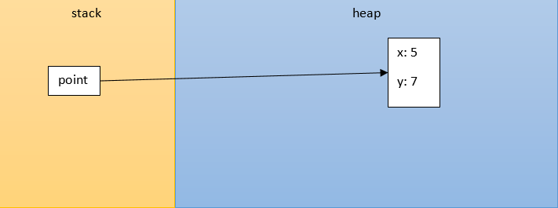
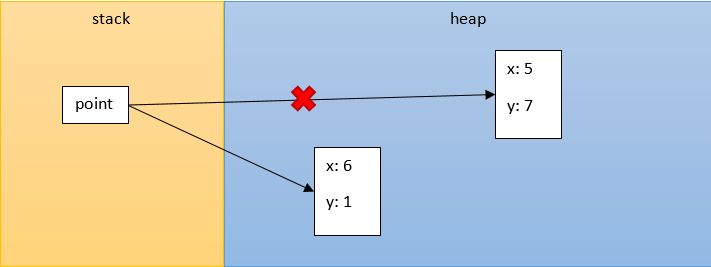
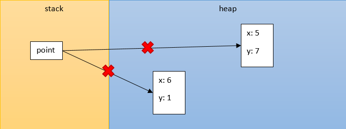

# Objektumok

Az osztályok általában csak "tervrajzok", a tényleges megvalósításukat objektumnak 
vagy példánynak nevezzük. Az attribútumok az objektum állapotát tárolják, ezért 
minden egyes objektumnak külön szelet jut a dinamikus memória (heap) területéből. 
Objektum az osztály példányosításával keletkezik, amelyet a `new` operátor hívásával 
érünk el. Ez alól kivétel a `String` típusú objektum, mely `String` típusú literál 
használatakor is létrejön. Ezeket az objektumokat mindig egy rájuk mutató referencián 
át érhetjük el, amelyet az általunk deklarált változó tartalmaz. Azaz meg kell 
különböztetnünk az objektumra mutató referenciát magától az objektumtól.

```java
Point point = new Point(5, 7);
```



```java
point = new Point(6, 1);
```



Amikor egy referencia változó nem mutat egyetlen objektumra sem, akkor azt egy 
speciális értékkel jelezzük, és ez a `null`. Mivel attribútumai és metódusai az 
objektumnak vannak és nem a változónak, ezért az ilyen változón nem hívhatunk 
egyetlen metódust sem.

```java
point = null;
```



Osztály típusú változó lehet egy metóduson belül lokális, de lehet más osztályban 
attribútum. Objektumok lehetnek tömb vagy kollekció elemei is. Sőt, kollekcióba 
kizárólag objektumok kerülhetnek, primitív típusok nem.

## Ellenőrző kérdések

* Mi a különbség az osztály és a példány között?
* Mit jelent a példányosítás?
* Mi a különbség az objektum és példány között?
* Milyen értéke lehet egy osztály típusú változónak?
* Mit jelent osztály típusú változó esetén az értékadás?

## Feladat

### Ojektumok

A `objects.ObjectsMain` osztály `main` metódusába dolgozz!

Hozz létre egy `Book` osztályt, melynek ne legyen sem attribútuma, sem metódusa!

Példányosíts egy `Book` objektumot, de ne add értékül semminek! Meg tudod ezt
tenni? Hozzá tudsz férni később?

A `System.out.println()` metódus paramétereként adj át egy, a paraméterben most
példányosított objektumot! Mit ír ki?

Deklarálj egy `Book` típusú `emptyBook` változót, de ne adj neki értéket, hanem azonnal
írd ki az értékét! Fog sikerülni?

Adj neki értéket, méghozzá a `null` literált! Írasd ki az értékét!

Vizsgáld meg, hogy az `emptyBook` változó értéke `null` érték-e! Írd ki a
vizsgálat eredményét!

Definiálj egy `book` nevű változót, és add értékül neki a definíciós utasításban
példányosított `Book` objektumot!

Írasd ki a `book` változó értékét!

Adj értéket neki, `null` literált, majd írd ki az értékét!

Adj neki értékül egy új `Book` példányt, majd írd ki!

Hozz létre egy `anotherBook` változót, és adj értékül neki egy új `Book`
példányt!

Hasonlítsd össze egyenlőség operátorral `(==)` a `book` és az `anotherBook` változó értékét, és írd ki az
eredményt!

A `anotherBook` változó értékéül add a `book` változó értékét! Írd ki!
Hasonlítsd össze egyenlőség operátorral `(==)` a `book` és az `anotherBook` változó értékét, és írd ki az
eredményt!

Vizsgáld meg, hogy az `anotherBook` változó értéke `Book` típusú-e! Ehhez az `instanceof` operátort kell
használni, azaz `System.out.println(anotherBook instanceof Book);`.

[rating feedback=java-objects-objektumok]

### Objektumok száma

A következő kód hány objektumot hoz létre? A futás végére mennyi
objektumhoz lehet hozzáférni?

```java
Book book1 = new Book();
Book book2 = new Book();
Book book3 = new Book();
Book book4 = book1;
Book book5 = book1;
Book book6 = book3;
Book book7 = null;
book4 = book5;
book5 = new Book();
book6 = null;
```

[rating feedback=java-objects-objektumokszama]

### Tömbök és kollekciók

Definiálj egy `Book` tömböt, és adj értékül neki egy tömb literált, három
példányosított `Book` objektummal!

Definiálj egy `List<Book>` kollekciót, és az `Arrays.asList()` metódust
használva tegyél bele három példányosított elemet!

Definiálj egy `List<Book>` üres kollekciót, majd adj hozzá három példányosított
objektumot!

[rating feedback=java-objects-tombkollekcio]

## Teszt

Melyik a helyes állítás?

* A referencia mindig a stacken jön létre.
* [x] Az objektum mindig a heapen jön létre.
* Az objektum mindig a stacken jön létre.
* A referencia mindig a heapen jön létre.

Vizsgáld meg az alábbi kódrészletet! Melyik állítás igaz?

```java
public class Main {
    public static void main(String[] args) {
        Book book1 = new Book("Gárdonyi Géza", "Egri csillagok");
        Book book2 = new Book("Arany János", "Balladák");
        Book book3 = book1;
    }
}
```

* A `main()` metódusban 2 referencia és 3 objektum van.
* A `main()` metódusban 3 referencia és 3 objektum van.
* A `main()` metódusban 2 referencia és 2 objektum van.
* [x] A `main()` metódusban 3 referencia és 2 objektum van.
