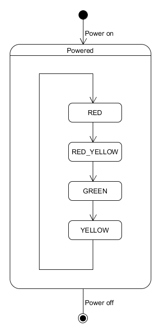

# Állapotgép

Az állapotgép tulajdonképpen egy olyan „szerkezet” amely különböző bemenetek hatására egyik állapotból a másikba lép. Fontos, hogy az állapotok száma véges, továbbá, hogy az állapotgép a saját állapota és a bement ismeretében egy állapotból csakis egy állapotba léphet át. Egy ilyen állapotgép például a jelzőlámpa, ahol a bemenet az idő múlása.

Az állapotgépet UML diagrammon nagyon egyszerűen lehet vizualizálni. Így felépíthető egy gráf ahol a csomópontok éppen az állapotok.

### Gyakorlatban
Javaban állapotgép implementációjára nagyon jól használható a felsorolásos típus. Ennek elemi lehetnek az állapotok, valamit deklarálhatunk egy metódust ami ezek között az állapotok között vált.
```java
public enum TrafficLight {

    RED {
        TrafficLight next() {
            return TrafficLight.RED_YELLOW;
        }
    },

    RED_YELLOW {
        TrafficLight next() {
            return TrafficLight.GREEN;
        }
    },

    GREEN {
        TrafficLight next() {
            return TrafficLight.YELLOW;
        }
    },

    YELLOW {
        TrafficLight next() {
            return TrafficLight.RED;
        }
    };

    abstract TrafficLight next();

}
```



## Ellenőrző kérdések

* Hogyan működik az állapotgép?
* Hogyan váltunk át egyik állapotból a másikba?


## Ülésfűtés gomb

Egy gombbal lehet állítani az autóban az ülésfűtést. Alapállapotban ki van kapcsolva.
Ha ekkor megnyomjuk, akkor maximális (3-as) fokozatra kapcsol a fűtés, ha mégegyszer megnyomjuk, akkor 2-es fokozatra áll, ha mégegyszer, akkor 1-esre áll, és ha mégegyszer, akkor kikapcsol.
Szimuláljuk a gomb működését, hogyan vált a 4 állapot között.

## Közlekedési lámpa

A közlekedési lámpa (magyarországi) működését modellezzük. Piros után piros-sárga, utána zöld, majd sárga és ismét piros következik.

## Elromlott az írógép

Képzeld el, hogy van egy régi hagyományos írógép, aminek a CAPS LOCK-ja elromlott és minden sor végén vált automatikusan.
Ha kisbetűs sort írtak vele, akkor nagybetűre vált, ha nagybetűs sort írtak, akkor kisbetűre vált.


## Bónusz feladat

Szimuláljuk egy egyszerű lift működését. Csak a földszint és az emelet között közlekedik. Négy állapota lehet:

* Földszint nyitott ajtóval
* Földszint csukott ajtóval
* Emelet nyitott ajtóval
* Emelet csukott ajtóval

Meg lehet hívni a liftet bármelyik szinten, illetve meg lehet nyomni a liftben a Földszint ill. az Emelet gombot.
Ezekkel a lift haladási irányát adjuk meg. Vigyázz, mert lehet, hogy a lift aktuális iránya más, amikor meghívjuk a liftet.
