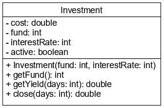

# Kifejezések és utasítások

A **kifejezés** operátorok (műveleti jelek) és operandusok (azok a literálok, 
változók vagy metódushívások, amelyekkel a műveletet elvégezzük) kombinációja, 
tipikusan egy érték kiszámítására.

## Operátorok

- Matematikai operátorok: `+`, `-`, `*`, `/`, `%`
- Példányosítás: `new`
- Értékadó operátor: `=`
- Összevont értékadó operátorok: `+=`, `-=`, `*=`, `/=`, `%=`, `&=`, `|=`, `^=`
- Összehasonlítás, egyenlőségvizsgálat: `<`, `<=`, `>`, `>=`, `==`, `!=`
- Logikai operátorok: `!`, `&`, `|`, `&&`, `||`
- Léptető operátorok (prefix és postfix): `++`, `--`
- Háromoperandusú operátor: `?:`

Összetett kifejezés esetén a műveletek elvégzésének sorrendje kötött, de 
megfelelő zárójelezéssel módosítható. Ehhez kerek zárójelet használunk.

VIGYÁZZ! Ne keverd össze az értékadó `=` és az egyenlőséget vizsgaló `==` operátorokat!

## Utasítások

Utasítás lehet

- változó deklaráció

```java
int age;
```

- értékadás

```java
age = 10;
```

- példányosítás

```java
new Random();
```

- metódushívás

```java
System.out.println("Hello World");
```

- vezérlő utasítás

```java
if (age < 18) {
    System.out.println("Too young");
}
```

A Java nyelvben minden utasítást pontosvesszővel kell lezárnunk. Ez alól csak 
néhány vezérlő utasítás a kivétel.

## Ellenőrző kérdések

* Mire valók a kifejezések?
* Írj fel néhány kifejezést!
* Milyen operátorokat ismersz?
* Java nyelven milyen utasításokat ismersz?

## Gyakorlati feladat

### Kísérletezz kifejezésekkel!

A `statements.StatementMain` osztály `main()` metódusában definiálj egy `int` típusú `x` változót,
melynek értéke az `5` és `6` literál összege.

Definiálj egy `int` típusú `y` változót, mely a `11` literálból kivont `x` változó értékét kapja.

Definiálj egy `int` típusú `z` változót, mely értéke `8`.

Definiálj egy `boolean` típusú `b` változót, mely értéke `true`, ha az `x` értéke
nagyobb, mint az `y` változó értéke.

Definiálj egy `boolean` típusú `c` változót, mely értéke `true`, ha a `b` értéke
`true`, vagy `z` értéke nagyobb, mint `5`.

A `z` értékéhez adj hozzá egyet egy operandusú operátorral.

### Befektetések

Egy befektetéskezelő cég legfeljebb egy év időtartamra vesz át összeget befektetésre 
az ügyfeleitől. Ezután bármikor meg lehet szüntetni a befektetést, és a tőkét az 
adott napig járó kamattal együtt ki lehet venni. Megszünetéskor a befektető cég 
kezelési költségként mindig levonja a kivett összeg 0,3%-át. Menet közben megszüntetés 
nélkül is le lehet kérdezni, hogy mennyi kamat járna az adott napig.



Hozd létre az `Investment` osztályt! Befektetés létrehozásakor (példányosításkor) 
az `active` attribútum értéke mindig igaz. A `getYield()` metódusa megkapja, hogy hány 
napra kérik le a hozamot, és visszaadja az adott időszakra kiszámított hozam 
összegét. A `close()` metódusa lezárja a befektetést, és ezzel egyidejűleg 
visszaadja a teljes kifizetett összeget. A lezárást az `active` attribútum hamisra 
állításával éri el. A kifizetett összeg tartalmazza a tőkét és a kamatokat csökkentve 
a kezelési költséggel. Amennyiben már lezárt befektetésre hívják meg a `close()` 
metódust, a kifizetett összeg 0 legyen!  
(Ötlet: használd a három operandusú operátort a kifizetett összeg kiszámításához!)

A metódusok implementálása során törekedj arra, hogy ne írd le kétszer ugyanazt 
a képletet, hanem használd a már elkészített metódusokat!

Próbáld ki a működését az `InvestMain` osztály `main()` metódusában! Kérd be 
a befektetett összeget és a kamatlábat a felhasználótól, majd írd ki a befektetés 
adatait! Próbáld meg kétszer is lezárni a befektetést! Például:

```
Befektetés összege:
100000
Kamatláb:
8
Tőke: 100000
Hozam 50 napra: 1095.890410958904
Kivett összeg 80 nap után: 101448.16438356164
Kivett összeg 90 nap után: 0.0
```


## Bónusz feladat 1.

Mit gondolsz, mikor értékelődik ki egy két literált összeadó kifejezés értéke?

Milyen figyelmeztetéseket ír ki az IDEA fejlesztőeszköz?

## Forrás

OCA - Chapter 2/Understanding Java Operators, Working with Binary Arithmetic
Operators, Working with Unary Operators, Using Additional Binary Operators

## Teszt

Melyik kifejezés helyes?

* [x] person.goHome();
* double perimeter = 2 * r * 3,14;
* String message = "Age: " - age;
* boolean isOddNumber = number % 2 = 0;

