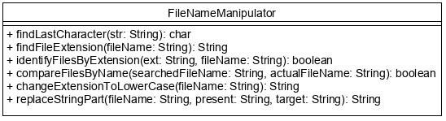
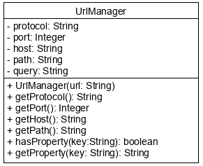

# Főbb `String` metódusok

A `String` immutable, így a módosítónak tűnő metódusai nem az adott objektum állapotán 
dolgoznak, hanem egy új `String`-et adnak vissza.

```java
String name = "John Doe";
String upperName = name.toUpperCase(); // name értéke nem változik
```

A metódusok meghívhatóak literálokon is.

```java
String upperName = "John Doe".toUpperCase();
```

Amikor egy változó értékét akarjuk összehasonlítani egy literállal, akkor
mindig a literált tegyük előre, mert ez nem lehet `null` (szemben a
változó értékével), és ezért nem keletkezhet `NullPointerException`.

```java
String s = "john doe";
boolean b = "John Doe".equalsIgnoreCase(s);
```

A metódushívások egymás után láncolhatók.

```java
String upperForename = "John Doe".toUpperCase().substring(0, 4);
```

Ebben a leckében csak a legfontosabb `String` metódusokat vizsgáljuk meg. A többi 
metódusért érdemes megnézni a Java API dokumentációt.

## Tulajdonságokat lekérdező metódusok

Ezek a metódusok a `String`-et különböző szempontok szerint vizsgálják meg, ezért 
a legtöbb logikai értékkel tér vissza.

A szöveg karakterben mért hosszát adja vissza a `length()` metódus. Minden olyan esetben hasznos, ahol a 
karaktereket be szeretnénk járni, vagy indexszel el szeretnénk érni. Ezek a metódusok 
ugyanis nem létező karakterre való hivatkozáskor `ArrayIndexOutOfBoundsException` kivételt 
dobnak. A `charAt()` metódusa például a paraméterként átadott indexű karaktert adja vissza.

```java
    String word = "Hello World";
    for(int i = 0; i < word.length(); i++) {
        System.out.print(word.charAt(i) + ",");
    } //H,e,l,l,o, ,W,o,r,l,d,
```

Gyakran szükség van arra, hogy megvizsgáljuk, kaptunk-e számunkra értelmes tartalmú szöveget. Az `isEmpty()` metódus 
azt vizsgálja, hogy üres-e a `String`. Ha nem csak az üres, hanem a csupán whitespace karaktereket tartalmazó szöveget is 
szeretnénk kiszűrni, használjuk a Java 11-ben megjelent `isBlank()` metódust. Ez akkor is igazzal tér vissza, 
ha a szöveg ugyan 5 karakterből áll, de egyik sem nyomtatható.

```java
private boolean hasContent(String s) {          // hasContent("   ") --> true
    return s != null && !s.isEmpty();
}

private boolean hasReadableContent(String s) {  // hasReadableContent("   ") --> false
    return s != null && !s.isBlank();
}
```

Két `String` egyezőségének vizsgálatára használható az `equals()` metódus. Amennyiben nem számítanak a 
kis-nagybetű különbségek, használd az `equalsIgnoreCase()` metódust!

```java
String word1 = "soap";
String word2 = "SoaP";
System.out.println(word1.equals(word2));            // false
System.out.println(word1.equalsIgnoreCase(word2));  // true
```

A szöveg nagyon egyszerű mintákra való illeszkedését vizsgálja a `startsWith()`, 
`endsWith()` és a `contains()` metódus. Mindhárom a keresett szövegrészt kapja 
paraméterül, és logikai értékkel tér vissza. Csak kis-nagybetű érzékeny verziójuk létezik, 
de a `toLowerCase()` vagy a `toUpperCase()` metódusokkal kombinálva jól használhatóak
akkor is, ha nem számítanak a kis-nagybetű különbségek.

Ezek a metódusok nem a mintát várják bemenetként, hanem csak konkrét szövegrészt! 

```java
"Hello World".startsWith("Hell")                         // true
"Hello World".endsWith("World")                          // true
"Hello World".contains(" w")                             // false
"Hello World".toLowerCase().contains(" w".toLowerCase()) //true
```

Ha nem csak az a kérdés, hogy egy szövegrész megtalálható-e egy `String`-ben, hanem az is, hogy hol, akkor 
használjuk az `indexOf()` metódust. Ez a paraméterül kapott szövegrész első előfordulásának 
kezdő indexét adja vissza. Amennyiben a paraméter nem található meg a szövegben, a visszatérési érték -1.

```java
int firstO = "Hello World".indexOf("o")     // 4
int firstOne = "Hello World".indexOf("one") // -1
```

Ha nem a legelső karaktertől kezdve szeretnénk keresni, akkor második paraméterként az indulási indexet is megadhatjuk.

```java
int secondO = "Hello World".indexOf("o", 5) // 7
```

## Szöveget gyártó metódusok

Név alapján azt gondolhatnánk, hogy ezek a metódusok módosítják a `String`-et, de 
mivel az immutable, ezért a művelet eredménye mindig egy új `String`, melyet a metódusok 
visszatérési értéke tartalmaz.

A szövegből kiemelhetünk egy rész a `substring()` metódussal. Bemenetként a kiemelendő 
rész kezdő és záró indexét várja. Ha a szöveg végére van szükségünk, a záró index elhagyható.

```java
String part = "This is the full sentence.".substring(5, 7); // "is"
String end = "It's another sentence.".substring(5);         // "another sentence."
```

Vigyázzunk, hogy mind a nyitó, mind a záró index létező legyen, különben kivétel keletkezik.

Ha a cél az, hogy a szöveg elején és végén lévő láthatatlan karaktereket levágjuk, 
akkor szerencsére nem kell nekünk megkeresni, hogy mely része kell a szövegnek, a `trim()` metódus 
megteszi ezt helyettünk. A metódus nem foglalkozik a szöveg közepén lévő többszörös 
szóközökkel vagy sorvége jelekkel, kizárólag a `String` elején és végén lévőkkel.

```java
String content = "    \t  readable    characters   \n".trim(); // "readable    characters"
```

A szöveg egy részének cseréjére alkalmazhatjuk a `replace()` metódust. Ezzel az első paraméterként 
átadott szövegrész minden előfordulását lecserélhetjük a második paraméterként átadottra.

```java
String resultString = "apple pear plum".replace(" p", " g"); // "apple gear glum"
```

A Java 11 óta ha ugyanazt a szöveget szeretnénk sokszor összefűzni, akkor nem kell 
a `concat()` metódust meghívnunk sokszor, hanem elég a `repeat()` metódust egyszer. 
Paraméterként az ismétlések számát várja. Ha a paraméter értéke 0, akkor üres 
szöveget ad vissza, de ha negatív, akkor kivételt dob.

```java
String empty = "ho".repeat(0);   // ""
String santa = "ho".repeat(3);   // "hohoho"
String oops = "ho".repeat(-2);   // IllegalArgumentException
```

Sokszor egyetlen szövegként kapunk meg több adatot, és ilyenkor az egyes részeket 
valamilyen elválasztó karakter vagy karaktersorozat szeparálja el egymástól. A `split()` metódus 
a kapott elválasztó karaktersorozat mentén szétvágja a szöveget és a keletkezett 
darabokat tömbként adja vissza. Bemenetként nem csak konkrét, hanem 
reguláris kifejezést tartalmazó szöveget is elfogad, így akár több karakter mentén is vághatunk. Ha paraméterként 
üres szöveget adunk át, akkor minden egyes karaktert külön szövegbe tesz.

```java
String[] words = "apple pear plum".split(" ");  // ["apple", "pear", "plum"]
String[] characters = "apple".split("");        // ["a", "p", "p", "l", "e"]
```

A Java 11 óta nem csak szétvágni, de összerakni is tudunk részekből szöveget. 
A `join()` metódus első paraméterként a használandó elválasztó karaktert várja, 
utána pedig sorban az összefűzendő `String`-eket. Az összefűzendő részeket akár 
tömbként vagy listaként is odaadhatjuk. **Ezt a metódust nem egy `String` 
objektumon, hanem magán az osztályon kell meghívni.**

```java
String message = String.join("-", "Java", "is", "cool");  // "Java-is-cool"
List<String> words = List.of("Java", "is", "cool");
String message2 = String.join("-", words);                // "Java-is-cool"
```

## Ellenőrző kérdések

* A `length()` metódus mit ad vissza a következő string esetében: " a p p l e" ?
* A `charAt()` metódus mit ad vissza: `"index".charAt(2)` hívás esetén?
* Az `indexOf()` metódus mit ad vissza `"index".indexOf('x')` hívás esetén?
* A `substring()` metódus hogyan értelmezi a paraméterként átadott indexeket?
* Az `equals()` és `equalsIgnoreCase()` metódusoknak mi a jelentősége?
* A `contains()` metódusnak mi a visszatérési értéke?
* A `replace()` metódus char vagy CharSequence paramétereket fogad. Mit jelent a CharSequence?
* A `trim()` metódus mit eredményez a következő string esetében: "\t an apple" ?

## Feladat

### Fájlnevek kezelése

Készítsünk egy `FileNameManipulator` osztályt, amely fájlnevek ellenőrzésére, illetve ehhez kapcsolódó
`String` műveletekre alkalmas metódusokat tartalmaz.



Hibakezelés

Az egyes funkcióknál a feldolgozhatatlan paraméterek és
paraméter kombinációk esetén dobjon `IllegalArgumentException`-t!

Tippek

Ha igény van rá, alkalmazzuk a metódusok láncolását!
Figyeljünk a vezető és követő `whitespace` karakterekre!

[rating feedback=java-stringmethods-filenamemanipulator]

### URL feldolgozás

https://earthquake.usgs.gov/fdsnws/event/1/query?format=geojson&starttime=2014-01-01&endtime=2014-01-02

Mi mindent tudhatunk meg ebből az URL-ből?

Egy URL általános alakja:  
protocol://host:port/path?query-string,  
ahol a path több `/` jellel elválasztott részből állhat, a query-string 
pedig key=value párok (property) `&` jellel elválasztott sorozata. 
Port megadása csak akkor kötelező, ha nem a protokoll által alapértelmezetten használt porton 
történik a kommunikáció.

A fenti URL részei eszerint:

* protocol: https (kötelező)
* host: earthquake.usgs.gov (kötelező)
* port: (nincs megadva)
* path: fdsnws/event/1/query
* query-stringként átadott adatok:
  * format = geojson
  * starttime = 2014-01-01
  * endtime = 2014-01-02
  
Készíts egy URL feldolgozót, mely a teljes URL-t konstruktorban kapja meg, és képes 
azonosítani az egyes részeit! A részek leválasztásához készíts privát segédmetódusokat! A protocol és a host 
szabvány szerint nem kis-nagybetű érzékenyek, ezért ezeket mindig csupa kisbetűvel 
tárold, míg a többi részt úgy, ahogy van. A `path` és a `query` legyen üres `String`, ha nincsenek az URL-ben.



A `getProperty()` metódus a property értékét adja vissza, amennyiben megtalálható a 
kapott `key` a `query` attribútumban kulcsként. 

Hibakezelés

A paraméterként kapott szöveget mindig validáld! Ha nincsenek meg az URL kötelező részei, 
dobj `IllegalArgumentException` kivételt! Amennyiben a `hasProperty()` vagy a `getProperty()` metódus 
`null`-t vagy csak `whitespace`-eket tartalmazó `String`-et kap, szintén `IllegalArgumentException` 
kivétellel jelezd!


## Teszt

Mit ír ki az alábbi kódrészlet?

```java
    System.out.print("    Hexo   World    ".trim().replace("x", "ll").substring(2, 10));
```

* [x] "llo   Wo"
* "lo   Wor"
* "llo Worl"
* "llo World"
