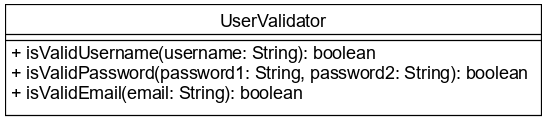

# Szöveges típus

Javaban a karakterláncokat, szövegeket a `String` osztály reprezentálja. Ugyanúgy 
példányosítható, mint más osztályok, de a `String` literált a JVM példányosítja 
helyettünk. A szöveget idézőjelek közé kell tennünk, például `"alma"`. Az üres 
szöveg literálja a `""`, ami nem ugyanaz, mint a `null`. Szövegek összefűzésére 
(konkatenálására) használható a `+` operátor. Mivel a `String` típusú változó 
referenciát tárol, ezért nem használható két szöveg összehasonlítására semmilyen 
operátor, ezeket a `String` metódusaival tudjuk vizsgálni.

## Metódusok

* `boolean equals(String str)`: a szöveg betűről betűre megegyezik-e a paraméterként átadott másik szöveggel.
* `int indexOf(String substring)`: a paraméterként átadott szöveg hol kezdődik az adott szövegben. Ha nem található, akkor -1-gyel tér vissza. A karakterek sorszámozása 0-ról indul.
* `int indexOf(String substring, int startIndex)`: a paraméterként átadott szöveg hol kezdődik az adott szövegben, de a keresést csak a `startIndex`-től kezdi.
* `int length()`: a szöveg hossza.
* `String substring(int beginIndex)`: visszaadja a szöveg egy részét a megadott indextől kezdve a végéig.
* `String substring(int beginIndex, int endIndex)`: visszaadja a megadott indexek közé eső szövegrészt.


## Ellenőrző kérdések

* Milyen típus a `String`?
* Hogyan definiálható `String` literál?
* Hogyan lehet két `String`-et összekapcsolni?
* Hogyan lehet egy `String`-et és egy primitív típust összekapcsolni?
* Hogyan lehet két `String`-et összehasonlítani?

## Feladat

### String műveletek

A `stringtype.StringTypeMain` osztály `main` metódusában
definiálj `prefix` néven egy `String` típusú változót, és add értékül
a `"Hello "` literál értékét.

Definiálj `name` néven egy `String` típusú változót, és add értékül
a `John Doe` literált.

Definiálj egy `message` változót, mely az előző két változó, összefűzve.

A `message` változó értékét írd felül a `message` változó értékével
úgy, hogy hozzákapcsolod még a `444` int literál értékét.

A `b` logikai változó tartalmazza, hogy a `message` értéke megegyezik-e
a `"Hello John Doe"` literál értékével.

A `c` logikai változó tartalmazza, hogy a `message` értéke megegyezik-e
a `"Hello John Doe444"` értékkel.

Konkatenálj össze két üres `String`-et, és írd ki az értékét! Hány karakter
hosszú lesz?

Írd ki külön sorban, külön utasításokban a következőket:

* Az `Abcde` String hossza
* Az első és harmadik karaktere (0-tól indexelünk) vesszővel elválasztva
* Az elsőtől a harmadik karakterig tartó részlete

[rating feedback=java-stringtype-stringoperations]

### Regisztrációs adatok vizsgálata

Amikor egy weboldalon regisztrációkor megadjuk az adatainkat, gyakran kapunk 
olyan visszajelzést, hogy a jelszavunk nem elég erős, vagy nem valid 
email címet adtunk meg. Készíts egy `UserValidator` osztályt a `stringtype.registration` 
csomagba, mely a regisztrációkor 
megadott adatokat validálja.



Regisztrációkor meg kell adnunk a felhasználónevet, a jelszót kétszer
és az email címet. A három metódus ezeket ellenőrzi:

* A felhasználónév megadása kötelező.
* A jelszó legalább 8 karakter hosszú kell legyen, és a két megadott jelszónak egyeznie kell.
* Az email címben kell lennie `@` karakternek és valamikor utána (de nem közvetlenül) pontnak. A `@` 
karakter nem lehet az első, az őt követő pont pedig az utolsó.

Készíts ugyanoda egy `Registration` osztályt, ahol a `main()` metódusban kérd be az 
adatokat! Jelezd a felhasználónak, ha bármelyik megadott adat hibás volt! Ha minden 
rendben volt, írd ki, hogy "Sikeres regisztráció"! Validáláshoz használd az 
elkészített metódusokat!

## Bónusz feladat 1.

Mi lesz a `"John" + 4 + 4` és a `4 + 4 + "John"` kifejezés értéke? Miért?

## Teszt

Mi lesz az alábbi műveletsor eredménye?

```java
String message = "Hello Java";
int index = message.indexOf("J");
String word = message.substring(index);
System.out.println(word.length());
```

* [x] 4
* 5
* 6
* "Hello "
* "Java"

